# 🏗️ QuantaEnergi Architecture Diagrams

## System Architecture Overview

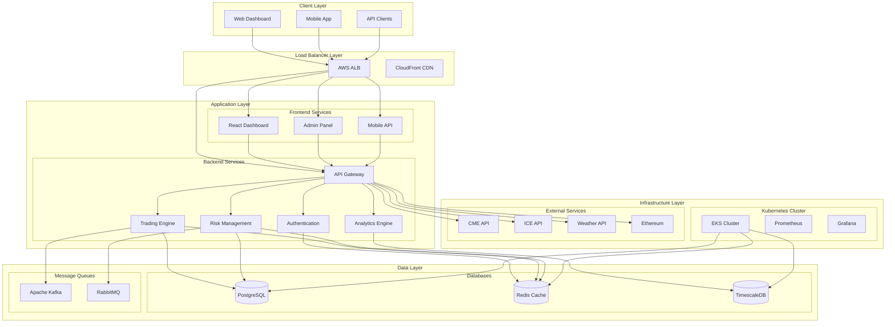
```

## Microservices Architecture

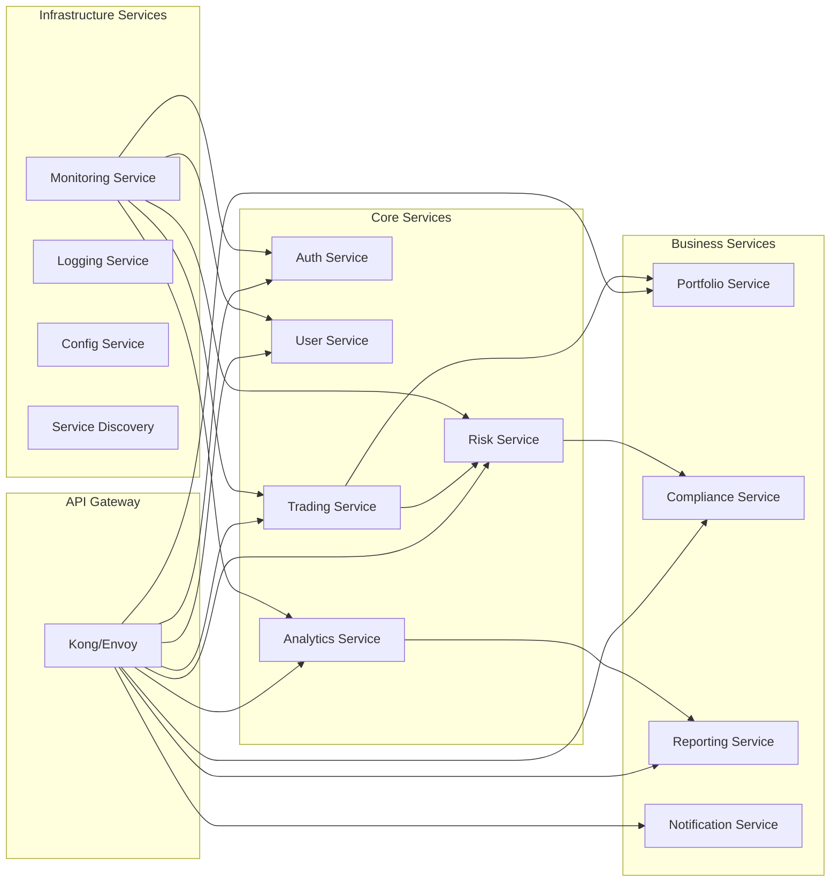

## Data Flow Architecture

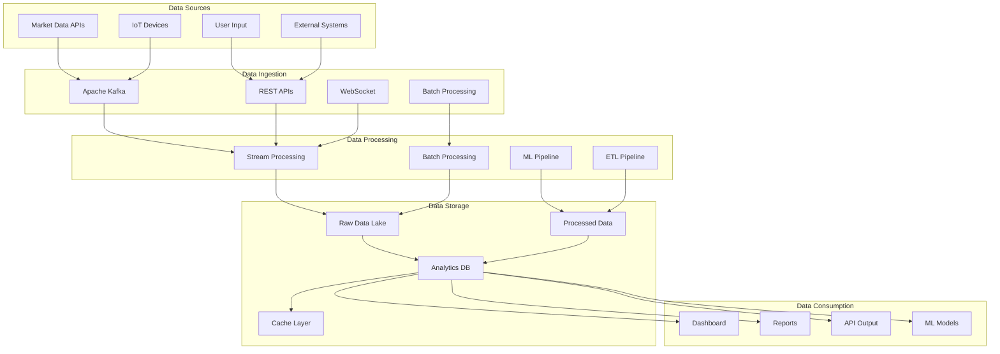

## Security Architecture

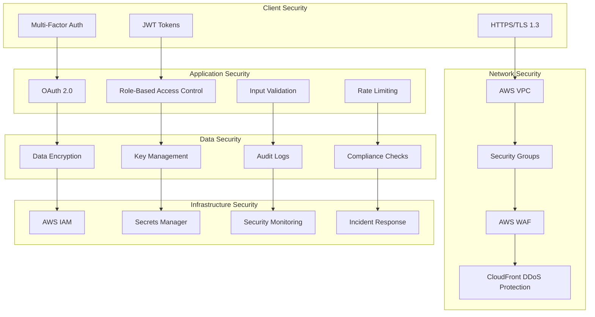

## Deployment Architecture

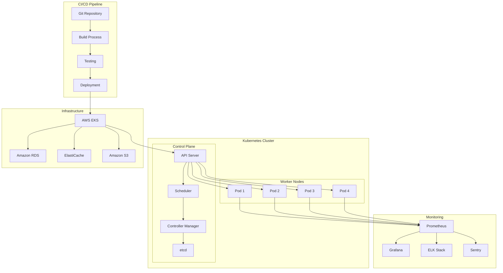

## Business Process Flow

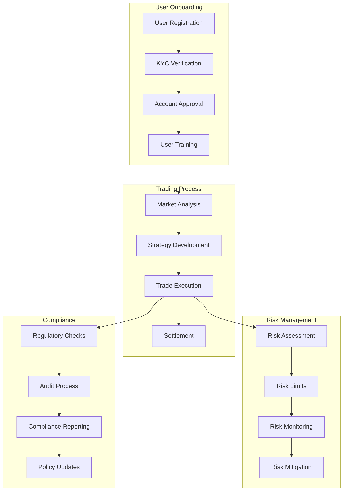

## Technology Stack

```mermaid
graph TB
    subgraph "Frontend"
        React[React 18]
        NextJS[Next.js 14]
        TypeScript[TypeScript 5]
        Tailwind[Tailwind CSS]
    end
    
    subgraph "Backend"
        FastAPI[FastAPI]
        Python[Python 3.11]
        SQLAlchemy[SQLAlchemy]
        Pydantic[Pydantic]
    end
    
    subgraph "Database"
        PostgreSQL[PostgreSQL 15]
        Redis[Redis 7]
        TimescaleDB[TimescaleDB]
        MongoDB[MongoDB]
    end
    
    subgraph "Infrastructure"
        Kubernetes[Kubernetes]
        Docker[Docker]
        AWS[AWS Services]
        Terraform[Terraform]
    end
    
    subgraph "Monitoring"
        Prometheus[Prometheus]
        Grafana[Grafana]
        ELK[ELK Stack]
        Jaeger[Jaeger]
    end
    
    subgraph "Security"
        JWT[JWT]
        OAuth[OAuth 2.0]
        Encryption[Encryption]
        WAF[WAF]
    end
    
    React --> NextJS
    NextJS --> TypeScript
    TypeScript --> Tailwind
    
    FastAPI --> Python
    Python --> SQLAlchemy
    SQLAlchemy --> Pydantic
    
    PostgreSQL --> Redis
    Redis --> TimescaleDB
    TimescaleDB --> MongoDB
    
    Kubernetes --> Docker
    Docker --> AWS
    AWS --> Terraform
    
    Prometheus --> Grafana
    Grafana --> ELK
    ELK --> Jaeger
    
    JWT --> OAuth
    OAuth --> Encryption
    Encryption --> WAF
```

## API Architecture

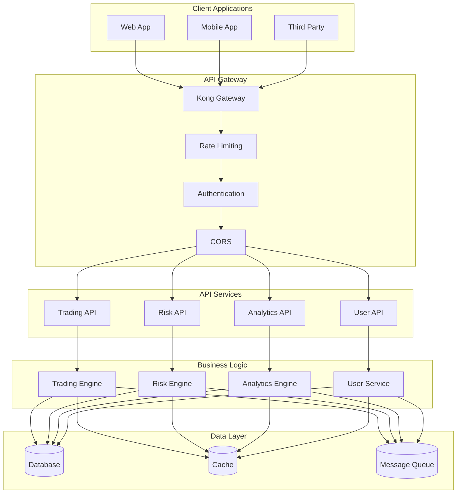

## Database Schema

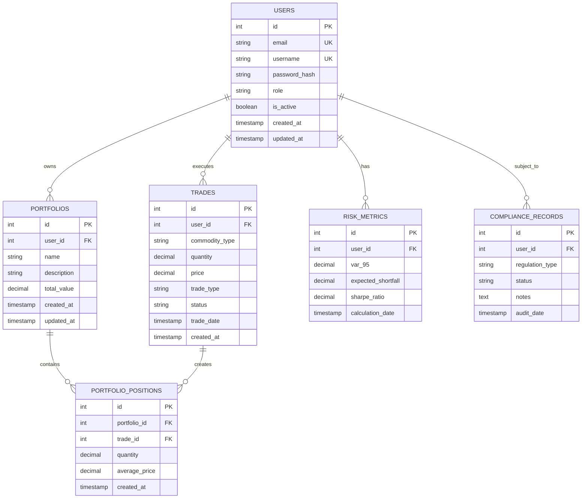

## Network Topology

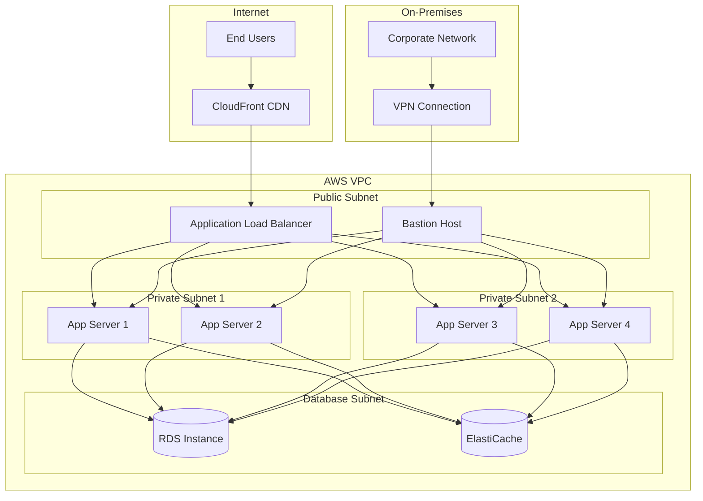

## Performance Metrics

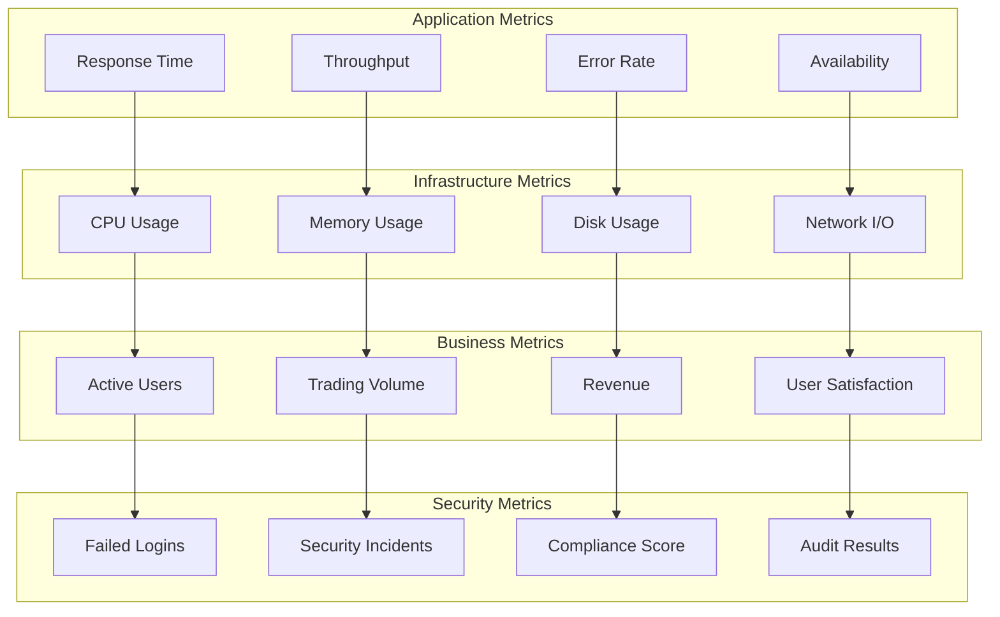

---

## 📊 Diagram Summary

These diagrams provide a comprehensive view of QuantaEnergi's architecture:

1. **System Architecture** - Overall system design
2. **Microservices** - Service decomposition
3. **Data Flow** - Data processing pipeline
4. **Security** - Security layers and controls
5. **Deployment** - Infrastructure and deployment
6. **Business Process** - User workflows
7. **Technology Stack** - Tools and frameworks
8. **API Architecture** - API design patterns
9. **Database Schema** - Data model
10. **Network Topology** - Network design
11. **Performance Metrics** - Monitoring and KPIs

All diagrams follow industry standards and best practices for enterprise software architecture.
