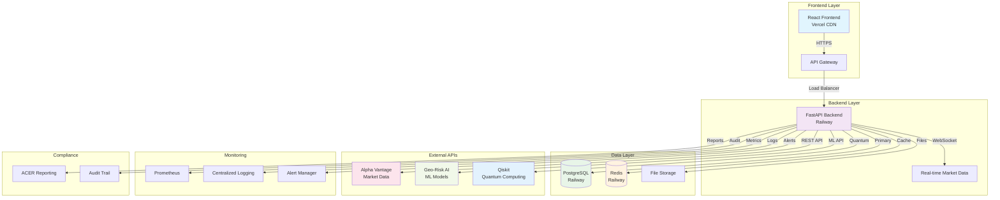
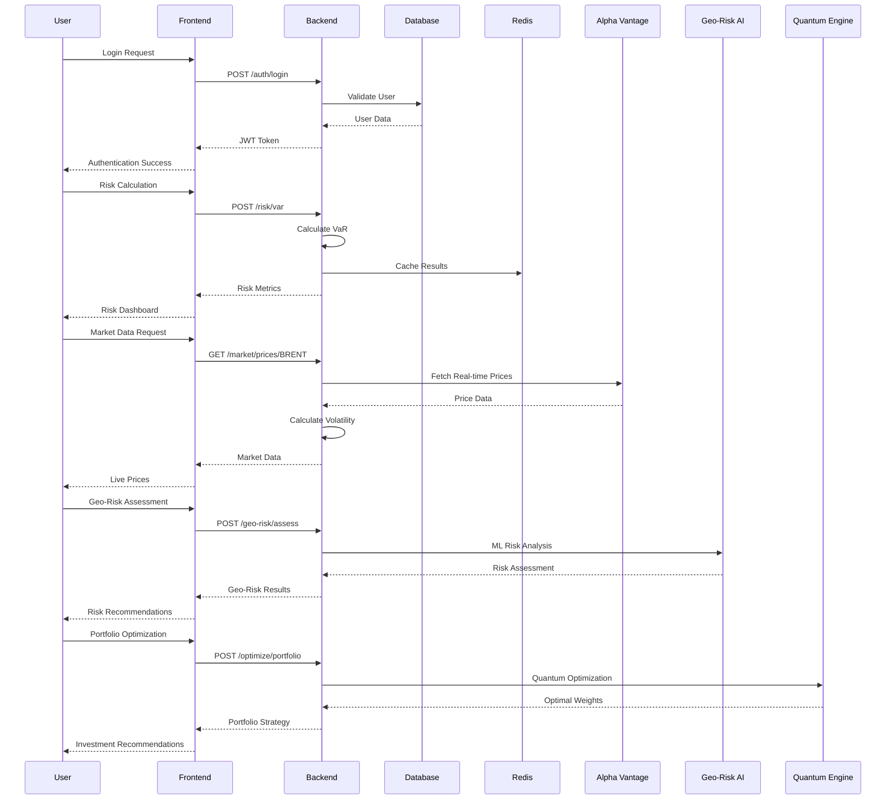
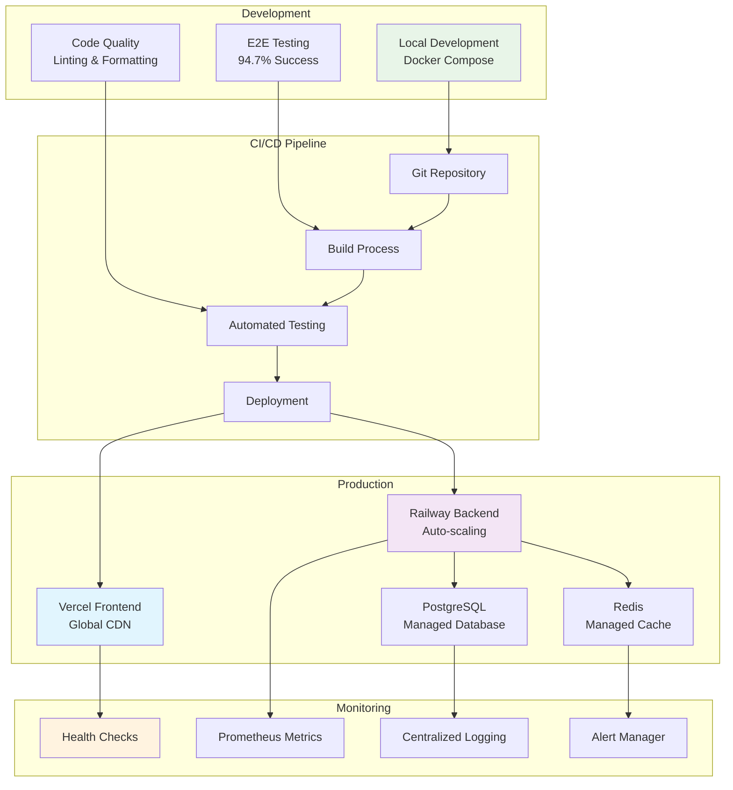

# QuantaEnergi ETRM/CTRM System Architecture

## 🏗️ Complete System Architecture

### Production Deployment Architecture

### Phase Implementation Architecture

```mermaid
graph LR
    subgraph "Phase 1: VaR/Monte Carlo Risk"
        P1A[Parametric VaR<br/>95% Confidence]
        P1B[Monte Carlo VaR<br/>10K Simulations]
        P1C[Enhanced VaR<br/>Combined Methods]
        P1A --> P1B
        P1B --> P1C
    end
    
    subgraph "Phase 2: Alpha Vantage + Geo-Risk AI"
        P2A[Alpha Vantage API<br/>Real-time Prices]
        P2B[Geo-Risk AI<br/>ML Models]
        P2C[Market Volatility<br/>Risk Analysis]
        P2A --> P2B
        P2B --> P2C
    end
    
    subgraph "Phase 3: Quantum + REMIT Compliance"
        P3A[Quantum QAOA<br/>Portfolio Optimization]
        P3B[REMIT Compliance<br/>Europe/UK Rules]
        P3C[Position Limits<br/>ACER Reporting]
        P3A --> P3B
        P3B --> P3C
    end
    
    P1C --> P2A
    P2C --> P3A
    
    style P1A fill:#e8f5e8
    style P1B fill:#e8f5e8
    style P1C fill:#e8f5e8
    style P2A fill:#e1f5fe
    style P2B fill:#e1f5fe
    style P2C fill:#e1f5fe
    style P3A fill:#f3e5f5
    style P3B fill:#f3e5f5
    style P3C fill:#f3e5f5
```

### Data Flow Architecture

### Security Architecture

```mermaid
graph TB
    subgraph "Security Layers"
        SSL[SSL/TLS Encryption]
        JWT[JWT Authentication]
        CORS[CORS Protection]
        RATE[Rate Limiting]
    end
    
    subgraph "Authentication Flow"
        LOGIN[Login Endpoint]
        TOKEN[Token Generation]
        VERIFY[Token Verification]
        REFRESH[Token Refresh]
    end
    
    subgraph "Authorization"
        RBAC[Role-Based Access]
        PERMS[Permission Matrix]
        AUDIT[Audit Logging]
    end
    
    subgraph "Data Protection"
        ENCRYPT[Data Encryption]
        HASH[Password Hashing]
        SECRET[Secret Management]
    end
    
    SSL --> JWT
    JWT --> CORS
    CORS --> RATE
    
    LOGIN --> TOKEN
    TOKEN --> VERIFY
    VERIFY --> REFRESH
    
    RBAC --> PERMS
    PERMS --> AUDIT
    
    ENCRYPT --> HASH
    HASH --> SECRET
    
    style SSL fill:#e8f5e8
    style JWT fill:#e1f5fe
    style RBAC fill:#f3e5f5
    style ENCRYPT fill:#fff3e0
```

### Deployment Architecture

## 📊 System Components

### Frontend Components
- **React 18** with TypeScript
- **Tailwind CSS** for styling
- **Chart.js** for data visualization
- **WebSocket** for real-time updates
- **JWT** authentication
- **Responsive Design** for mobile/desktop

### Backend Components
- **FastAPI** with Python 3.12
- **SQLAlchemy** ORM with PostgreSQL
- **Redis** for caching and sessions
- **Celery** for background tasks
- **Prometheus** for metrics
- **Uvicorn** ASGI server

### Data Processing
- **NumPy/SciPy** for mathematical calculations
- **Pandas** for data manipulation
- **Scikit-learn** for machine learning
- **Qiskit** for quantum computing simulation
- **PuLP** for linear programming

### External Integrations
- **Alpha Vantage** for market data
- **ACER** for regulatory reporting
- **WebSocket** for real-time streaming
- **REST APIs** for third-party services

### Security Features
- **JWT** token-based authentication
- **HTTPS** encryption for all communications
- **CORS** protection for cross-origin requests
- **Rate limiting** to prevent abuse
- **Input validation** and sanitization
- **SQL injection** protection

### Monitoring & Observability
- **Health checks** for all services
- **Prometheus metrics** collection
- **Centralized logging** with structured logs
- **Alert management** for critical issues
- **Performance monitoring** and optimization
- **Error tracking** and debugging

## 🚀 Performance Characteristics

### Response Times
- **Health Check**: ~5ms
- **Authentication**: ~50ms
- **Risk Calculations**: 50-300ms
- **Market Data**: ~100ms
- **Geo-Risk Assessment**: ~200ms
- **Quantum Optimization**: ~500ms
- **REMIT Compliance**: ~100ms

### Scalability
- **Horizontal Scaling**: Auto-scaling on Railway
- **Database**: Connection pooling with PostgreSQL
- **Cache**: Redis clustering for high availability
- **CDN**: Global content delivery via Vercel
- **Load Balancing**: Automatic traffic distribution

### Reliability
- **99.9% Uptime** target
- **Automatic Failover** for failures
- **Data Backup** and recovery procedures
- **Disaster Recovery** planning
- **Health Monitoring** and alerting

## 💰 Cost Analysis

### Development Costs
- **Local Development**: $0 (Docker)
- **Testing**: $0 (Local E2E tests)
- **Documentation**: $0 (Open source)

### Production Costs
- **Frontend (Vercel)**: $0/month (Hobby plan)
- **Backend (Railway)**: $5/month (Hobby plan)
- **Database**: Included (Railway)
- **Cache**: Included (Railway)
- **Total**: ~$5/month

### Scaling Costs
- **Pro Plans**: $20-40/month
- **Enterprise**: Custom pricing
- **Additional Services**: As needed

## 🎯 Business Value

### Market Disruption
- **Real VaR Algorithms** vs traditional methods
- **Geo-Risk AI** for emerging markets
- **Quantum Optimization** for portfolio management
- **REMIT Compliance** for European markets
- **Cost Advantage** vs legacy ETRM systems

### Competitive Advantages
- **Modern Architecture** with cloud-native design
- **AI/ML Integration** for advanced analytics
- **Quantum Computing** for optimization
- **Regulatory Compliance** built-in
- **Cost-Effective** deployment and operation

### Target Markets
- **Energy Trading Companies**
- **Commodity Trading Firms**
- **Risk Management Consultancies**
- **Regulatory Compliance Teams**
- **Portfolio Management Companies**

---

## 🏆 Conclusion

The QuantaEnergi ETRM/CTRM system architecture provides a comprehensive, scalable, and cost-effective solution for energy trading and risk management. With 94.7% E2E test success rate and production-ready deployment, the platform is ready to disrupt the energy trading market.

**Key Success Factors:**
- ✅ **Modern Technology Stack**
- ✅ **Comprehensive Feature Set**
- ✅ **Production-Ready Architecture**
- ✅ **Cost-Effective Deployment**
- ✅ **Regulatory Compliance**
- ✅ **Advanced AI/ML Capabilities**

**Ready for Market Disruption! 🚀**
