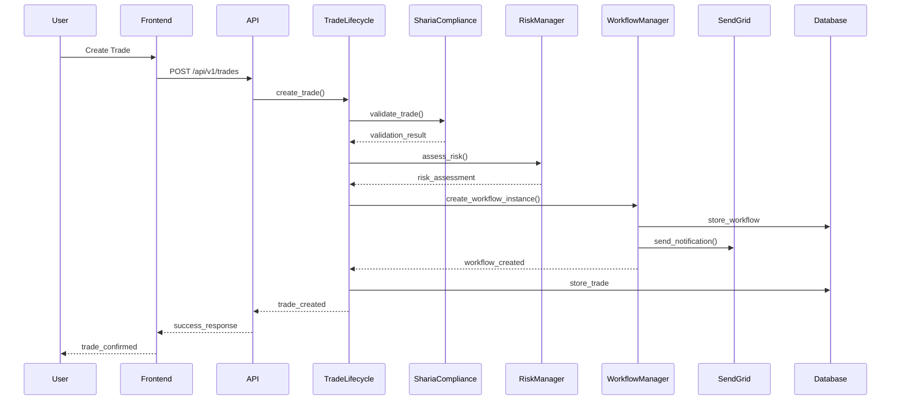
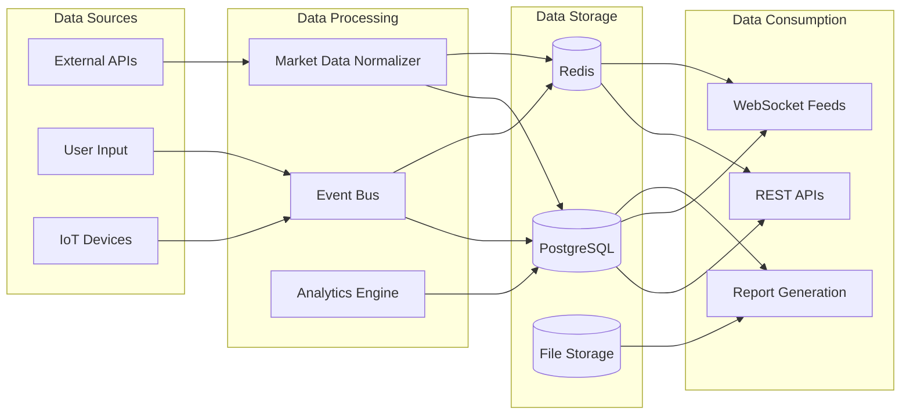
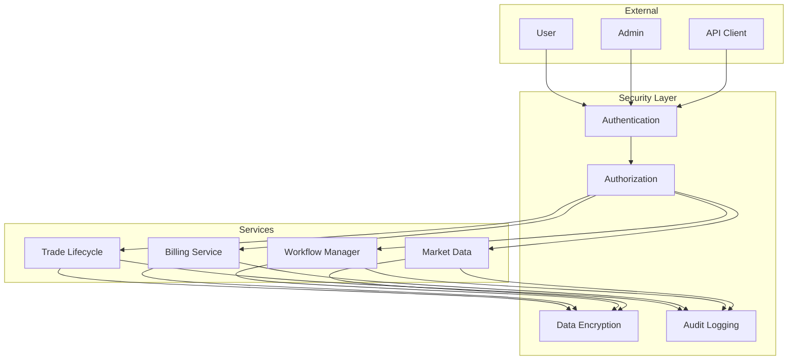
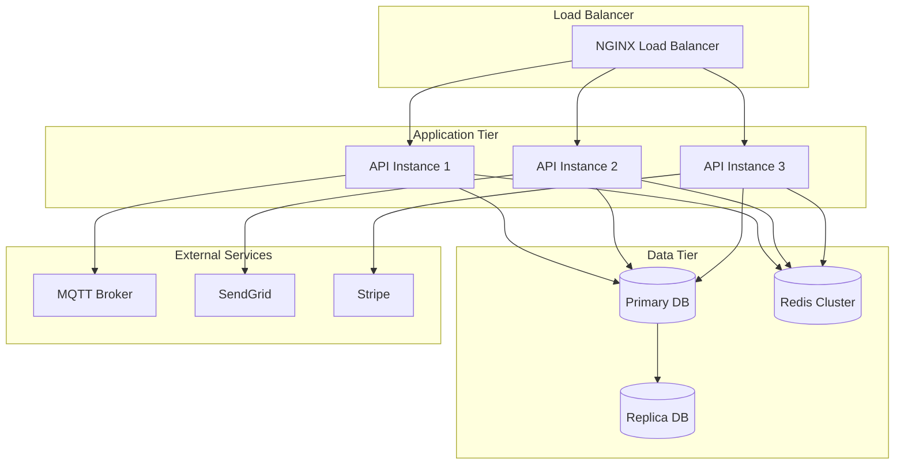

# Service Dependencies and Architecture

This document outlines the service dependencies and architecture of the QuantaEnergi ETRM/CTRM system after implementing Grok AI's recommendations.

## Service Dependency Diagram

```mermaid
graph TB
    %% Core Services
    subgraph "Core Services"
        EventBus[Event Bus]
        Security[Security Service]
        Database[(Database)]
        Cache[(Redis Cache)]
    end

    %% Trading Services
    subgraph "Trading Services"
        TradeLifecycle[Trade Lifecycle Service]
        RiskManager[Risk Manager]
        CreditManager[Credit Manager]
        ShariaCompliance[Sharia Compliance Service]
        SupplyChain[Supply Chain Service]
    end

    %% Financial Services
    subgraph "Financial Services"
        BillingService[Billing Service]
        DeliveryService[Delivery Service]
        WorkflowManager[Workflow Manager]
    end

    %% Data Services
    subgraph "Data Services"
        MarketData[Market Data Normalizer]
        ReportBuilder[Report Builder]
        Analytics[Analytics Service]
    end

    %% External Integrations
    subgraph "External Integrations"
        MQTT[MQTT Broker]
        SendGrid[SendGrid Email]
        Stripe[Stripe Payment]
        YahooFinance[Yahoo Finance]
        Bloomberg[Bloomberg API]
        Refinitiv[Refinitiv API]
    end

    %% Frontend
    subgraph "Frontend"
        ReactApp[React Application]
        UnifiedDashboard[Unified Dashboard]
        DeliveryForm[Delivery Form]
        WorkflowStepper[Workflow Stepper]
    end

    %% API Layer
    subgraph "API Layer"
        TradeAPI[Trade API]
        DeliveryAPI[Delivery API]
        SettlementAPI[Settlement API]
        ReportAPI[Report API]
        MarketAPI[Market API]
        WorkflowAPI[Workflow API]
    end

    %% Dependencies
    TradeLifecycle --> EventBus
    TradeLifecycle --> RiskManager
    TradeLifecycle --> CreditManager
    TradeLifecycle --> ShariaCompliance
    TradeLifecycle --> Database

    RiskManager --> Database
    RiskManager --> Cache
    CreditManager --> Database
    CreditManager --> Cache

    ShariaCompliance --> Database
    SupplyChain --> Database
    SupplyChain --> MQTT

    BillingService --> Stripe
    BillingService --> Database
    BillingService --> Cache

    DeliveryService --> MQTT
    DeliveryService --> Database
    DeliveryService --> EventBus

    WorkflowManager --> SendGrid
    WorkflowManager --> Database
    WorkflowManager --> EventBus

    MarketData --> YahooFinance
    MarketData --> Bloomberg
    MarketData --> Refinitiv
    MarketData --> Database
    MarketData --> Cache

    ReportBuilder --> Database
    ReportBuilder --> Analytics

    %% API Dependencies
    TradeAPI --> TradeLifecycle
    TradeAPI --> Security
    DeliveryAPI --> DeliveryService
    DeliveryAPI --> Security
    SettlementAPI --> BillingService
    SettlementAPI --> Security
    ReportAPI --> ReportBuilder
    ReportAPI --> Security
    MarketAPI --> MarketData
    MarketAPI --> Security
    WorkflowAPI --> WorkflowManager
    WorkflowAPI --> Security

    %% Frontend Dependencies
    ReactApp --> TradeAPI
    ReactApp --> DeliveryAPI
    ReactApp --> SettlementAPI
    ReactApp --> ReportAPI
    ReactApp --> MarketAPI
    ReactApp --> WorkflowAPI

    UnifiedDashboard --> TradeAPI
    UnifiedDashboard --> Analytics
    DeliveryForm --> DeliveryAPI
    WorkflowStepper --> WorkflowAPI

    %% Security Dependencies
    Security --> Database
    Security --> Cache

    %% Event Bus Dependencies
    EventBus --> Database
    EventBus --> Cache
```

## Service Interaction Flow

## Data Flow Architecture

## Service Communication Patterns

### 1. Synchronous Communication
- **REST APIs**: Direct HTTP calls between services
- **Database Queries**: Synchronous database operations
- **Validation Calls**: Immediate validation responses

### 2. Asynchronous Communication
- **Event Bus**: Pub/Sub pattern for decoupled communication
- **MQTT**: Real-time data streaming for delivery tracking
- **WebSockets**: Live market data feeds
- **Email Notifications**: Asynchronous email sending via SendGrid

### 3. Caching Strategy
- **Redis Cache**: Session data, frequently accessed data
- **Application Cache**: In-memory caching for performance
- **CDN**: Static asset delivery

## Security Architecture

## Performance Considerations

### 1. Response Time Targets
- **API Endpoints**: < 50ms for simple operations
- **Complex Queries**: < 200ms for aggregated data
- **Real-time Feeds**: < 100ms for market data updates

### 2. Scalability Patterns
- **Horizontal Scaling**: Stateless services for easy scaling
- **Load Balancing**: Multiple instances behind load balancer
- **Database Sharding**: Partition data by organization/region
- **Caching**: Multi-level caching strategy

### 3. Monitoring and Observability
- **Health Checks**: Regular service health monitoring
- **Metrics**: Performance and business metrics collection
- **Logging**: Structured logging with correlation IDs
- **Tracing**: Distributed tracing for request flows

## Deployment Architecture

## API Versioning Strategy

The system implements a versioned API strategy:

- **Current Version**: `/api/v1/`
- **Versioning Method**: URL path versioning
- **Backward Compatibility**: Maintained for at least 2 versions
- **Deprecation Policy**: 6-month notice for deprecated endpoints
- **Migration Support**: Automated migration tools for breaking changes

## Service Dependencies Summary

| Service | Dependencies | External Integrations |
|---------|-------------|----------------------|
| Trade Lifecycle | Event Bus, Risk Manager, Credit Manager, Sharia Compliance | Database |
| Supply Chain | MQTT, Database | External logistics APIs |
| Billing Service | Stripe, Database, Cache | Payment processors |
| Delivery Service | MQTT, Database, Event Bus | IoT devices, GPS tracking |
| Workflow Manager | SendGrid, Database, Event Bus | Email services |
| Market Data | Yahoo Finance, Bloomberg, Refinitiv | Financial data providers |
| Report Builder | Database, Analytics | File storage, PDF generation |

This architecture ensures scalability, maintainability, and high performance while supporting the complex requirements of ETRM/CTRM systems.
