# 🚀 Deployment Diagrams

## Infrastructure Architecture

## Container Deployment Architecture

```mermaid
graph TB
    subgraph "🐳 Docker Containers"
        subgraph "Frontend Container"
            Frontend_Container[Frontend Container]
            Nginx[Nginx Web Server]
            React_App[React Application]
            Static_Files[Static Files]
        end

        subgraph "Backend Container"
            Backend_Container[Backend Container]
            FastAPI_App[FastAPI Application]
            Uvicorn[Uvicorn Server]
            Python_Env[Python Environment]
        end

        subgraph "Database Container"
            DB_Container[Database Container]
            PostgreSQL_DB[PostgreSQL Database]
            Redis_Cache[Redis Cache]
        end

        subgraph "Worker Container"
            Worker_Container[Worker Container]
            Celery[Celery Workers]
            Background_Tasks[Background Tasks]
        end
    end

    subgraph "🔧 Orchestration"
        Docker_Compose[Docker Compose]
        Kubernetes[Kubernetes Cluster]
        Load_Balancer[Load Balancer]
    end

    subgraph "🌐 Network"
        Network[Internal Network]
        External_Network[External Network]
    end

    %% Container relationships
    Frontend_Container --> Nginx
    Nginx --> React_App
    React_App --> Static_Files

    Backend_Container --> FastAPI_App
    FastAPI_App --> Uvicorn
    Uvicorn --> Python_Env

    DB_Container --> PostgreSQL_DB
    DB_Container --> Redis_Cache

    Worker_Container --> Celery
    Celery --> Background_Tasks

    %% Orchestration
    Docker_Compose --> Frontend_Container
    Docker_Compose --> Backend_Container
    Docker_Compose --> DB_Container
    Docker_Compose --> Worker_Container

    Kubernetes --> Docker_Compose
    Load_Balancer --> Frontend_Container
    Load_Balancer --> Backend_Container

    %% Network
    Frontend_Container --> Network
    Backend_Container --> Network
    DB_Container --> Network
    Worker_Container --> Network
    Network --> External_Network

    classDef container fill:#e1f5fe
    classDef orchestration fill:#f3e5f5
    classDef network fill:#e8f5e8

    class Frontend_Container,Backend_Container,DB_Container,Worker_Container,Nginx,React_App,Static_Files,FastAPI_App,Uvicorn,Python_Env,PostgreSQL_DB,Redis_Cache,Celery,Background_Tasks container
    class Docker_Compose,Kubernetes,Load_Balancer orchestration
    class Network,External_Network network
```

## Cloud Deployment Architecture

## Environment Architecture

## Security Architecture

## Scalability Architecture

