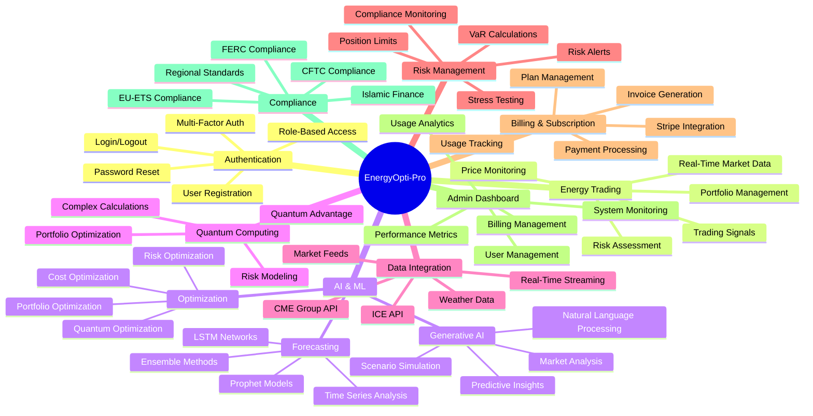
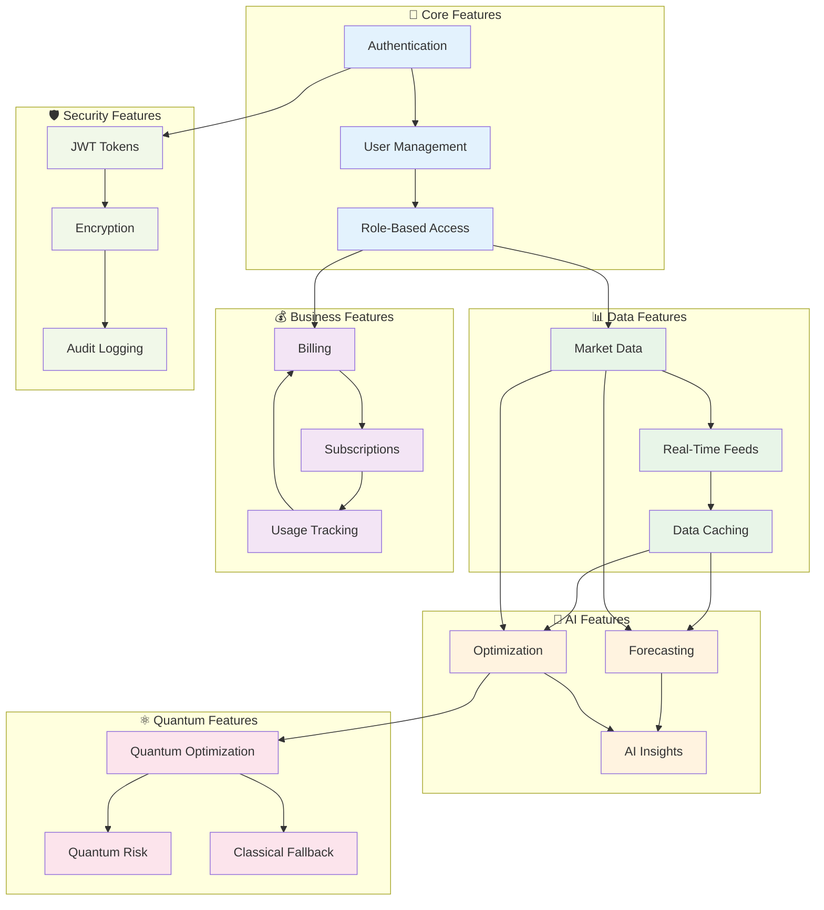
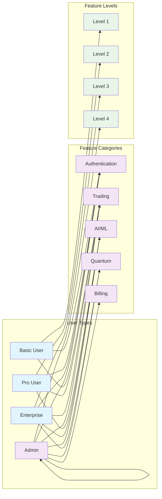
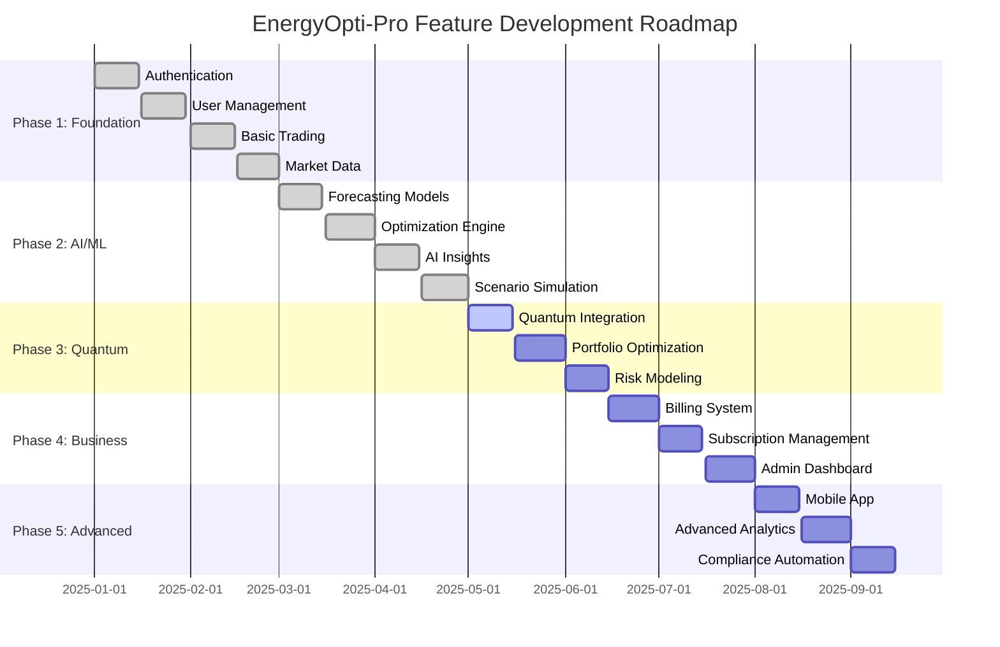
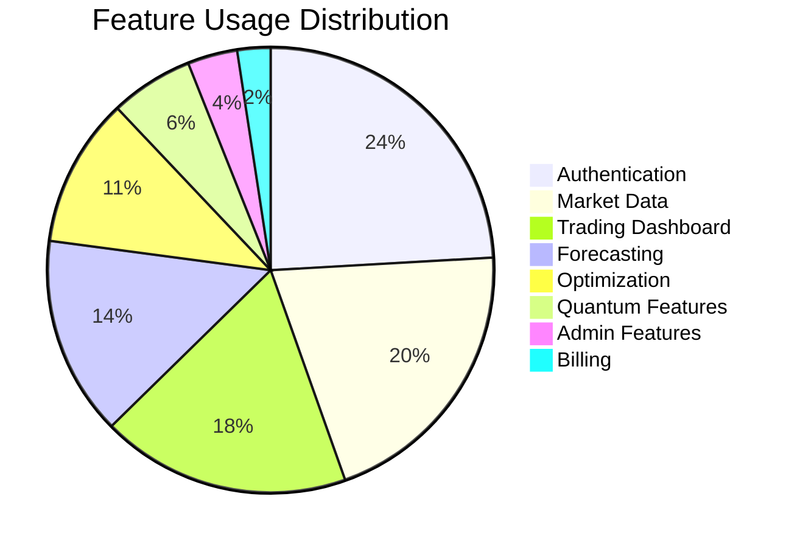
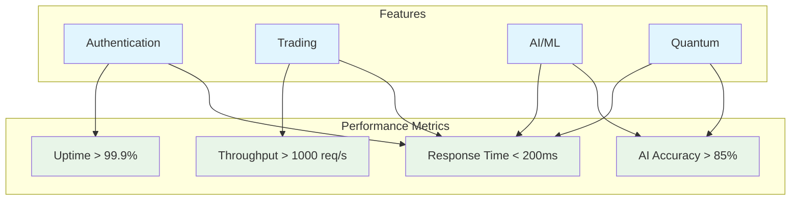

# 🎯 Feature Diagrams

## Feature Hierarchy

```mermaid
mindmap
  root((EnergyOpti-Pro))
    Authentication
      User Registration
      Login/Logout
      Password Reset
      Multi-Factor Auth
      Role-Based Access
    Energy Trading
      Real-Time Market Data
      Price Monitoring
      Trading Signals
      Portfolio Management
      Risk Assessment
    AI & ML
      Forecasting
        Time Series Analysis
        Prophet Models
        LSTM Networks
        Ensemble Methods
      Optimization
        Portfolio Optimization
        Risk Optimization
        Cost Optimization
        Quantum Optimization
      Generative AI
        Scenario Simulation
        Market Analysis
        Predictive Insights
        Natural Language Processing
    Quantum Computing
      Portfolio Optimization
      Risk Modeling
      Complex Calculations
      Quantum Advantage
    Data Integration
      CME Group API
      ICE API
      Weather Data
      Market Feeds
      Real-Time Streaming
    Risk Management
      VaR Calculations
      Stress Testing
      Position Limits
      Compliance Monitoring
      Risk Alerts
    Billing & Subscription
      Stripe Integration
      Plan Management
      Usage Tracking
      Invoice Generation
      Payment Processing
    Admin Dashboard
      User Management
      System Monitoring
      Usage Analytics
      Billing Management
      Performance Metrics
    Compliance
      FERC Compliance
      CFTC Compliance
      EU-ETS Compliance
      Islamic Finance
      Regional Standards
```

## Feature Dependencies

```mermaid
graph TB
    subgraph "🔐 Core Features"
        Auth[Authentication]
        UserMgmt[User Management]
        RBAC[Role-Based Access]
    end

    subgraph "📊 Data Features"
        MarketData[Market Data]
        RealTime[Real-Time Feeds]
        DataCache[Data Caching]
    end

    subgraph "🤖 AI Features"
        Forecasting[Forecasting]
        Optimization[Optimization]
        AI_Insights[AI Insights]
    end

    subgraph "⚛️ Quantum Features"
        Quantum_Opt[Quantum Optimization]
        Quantum_Risk[Quantum Risk]
        Classical_Fallback[Classical Fallback]
    end

    subgraph "💰 Business Features"
        Billing[Billing]
        Subscriptions[Subscriptions]
        Usage[Usage Tracking]
    end

    subgraph "🛡️ Security Features"
        JWT[JWT Tokens]
        Encryption[Encryption]
        Audit[Audit Logging]
    end

    %% Core dependencies
    Auth --> UserMgmt
    UserMgmt --> RBAC
    RBAC --> MarketData
    RBAC --> Billing

    %% Data dependencies
    MarketData --> RealTime
    RealTime --> DataCache
    DataCache --> Forecasting
    DataCache --> Optimization

    %% AI dependencies
    Forecasting --> AI_Insights
    Optimization --> AI_Insights
    MarketData --> Forecasting
    MarketData --> Optimization

    %% Quantum dependencies
    Optimization --> Quantum_Opt
    Quantum_Opt --> Quantum_Risk
    Quantum_Opt --> Classical_Fallback

    %% Business dependencies
    Billing --> Subscriptions
    Subscriptions --> Usage
    Usage --> Billing

    %% Security dependencies
    Auth --> JWT
    JWT --> Encryption
    Encryption --> Audit

    classDef core fill:#e3f2fd
    classDef data fill:#e8f5e8
    classDef ai fill:#fff3e0
    classDef quantum fill:#fce4ec
    classDef business fill:#f3e5f5
    classDef security fill:#f1f8e9

    class Auth,UserMgmt,RBAC core
    class MarketData,RealTime,DataCache data
    class Forecasting,Optimization,AI_Insights ai
    class Quantum_Opt,Quantum_Risk,Classical_Fallback quantum
    class Billing,Subscriptions,Usage business
    class JWT,Encryption,Audit security
```

## Feature Matrix

```mermaid
graph LR
    subgraph "User Types"
        Basic[Basic User]
        Pro[Pro User]
        Enterprise[Enterprise]
        Admin[Admin]
    end

    subgraph "Feature Categories"
        Auth[Authentication]
        Trading[Trading]
        AI[AI/ML]
        Quantum[Quantum]
        Admin[Admin]
        Billing[Billing]
    end

    subgraph "Feature Levels"
        L1[Level 1]
        L2[Level 2]
        L3[Level 3]
        L4[Level 4]
    end

    Basic --> Auth
    Basic --> Trading
    Basic --> L1

    Pro --> Auth
    Pro --> Trading
    Pro --> AI
    Pro --> L2

    Enterprise --> Auth
    Enterprise --> Trading
    Enterprise --> AI
    Enterprise --> Quantum
    Enterprise --> L3

    Admin --> Auth
    Admin --> Trading
    Admin --> AI
    Admin --> Quantum
    Admin --> Admin
    Admin --> Billing
    Admin --> L4

    classDef user fill:#e1f5fe
    classDef feature fill:#f3e5f5
    classDef level fill:#e8f5e8

    class Basic,Pro,Enterprise,Admin user
    class Auth,Trading,AI,Quantum,Admin,Billing feature
    class L1,L2,L3,L4 level
```

## Feature Roadmap

```mermaid
gantt
    title EnergyOpti-Pro Feature Development Roadmap
    dateFormat  YYYY-MM-DD
    section Phase 1: Foundation
    Authentication           :done, auth, 2025-01-01, 2025-01-15
    User Management         :done, usermgmt, 2025-01-16, 2025-01-30
    Basic Trading           :done, trading, 2025-02-01, 2025-02-15
    Market Data             :done, marketdata, 2025-02-16, 2025-03-01

    section Phase 2: AI/ML
    Forecasting Models      :done, forecasting, 2025-03-01, 2025-03-15
    Optimization Engine     :done, optimization, 2025-03-16, 2025-04-01
    AI Insights             :done, aiinsights, 2025-04-01, 2025-04-15
    Scenario Simulation     :done, scenarios, 2025-04-16, 2025-05-01

    section Phase 3: Quantum
    Quantum Integration     :active, quantum, 2025-05-01, 2025-05-15
    Portfolio Optimization  :quantum_opt, 2025-05-16, 2025-06-01
    Risk Modeling           :quantum_risk, 2025-06-01, 2025-06-15

    section Phase 4: Business
    Billing System          :billing, 2025-06-15, 2025-07-01
    Subscription Management :subscription, 2025-07-01, 2025-07-15
    Admin Dashboard         :admin, 2025-07-16, 2025-08-01

    section Phase 5: Advanced
    Mobile App             :mobile, 2025-08-01, 2025-08-15
    Advanced Analytics     :analytics, 2025-08-16, 2025-09-01
    Compliance Automation  :compliance, 2025-09-01, 2025-09-15
```

## Feature Usage Analytics

```mermaid
pie title Feature Usage Distribution
    "Authentication" : 100
    "Market Data" : 85
    "Trading Dashboard" : 75
    "Forecasting" : 60
    "Optimization" : 45
    "Quantum Features" : 25
    "Admin Features" : 15
    "Billing" : 10
```

## Feature Performance Metrics

```mermaid
graph TB
    subgraph "Performance Metrics"
        ResponseTime[Response Time < 200ms]
        Throughput[Throughput > 1000 req/s]
        Uptime[Uptime > 99.9%]
        Accuracy[AI Accuracy > 85%]
    end

    subgraph "Features"
        Auth[Authentication]
        Trading[Trading]
        AI[AI/ML]
        Quantum[Quantum]
    end

    Auth --> ResponseTime
    Auth --> Uptime
    Trading --> ResponseTime
    Trading --> Throughput
    AI --> Accuracy
    AI --> ResponseTime
    Quantum --> Accuracy
    Quantum --> ResponseTime

    classDef metrics fill:#e8f5e8
    classDef features fill:#e1f5fe

    class ResponseTime,Throughput,Uptime,Accuracy metrics
    class Auth,Trading,AI,Quantum features
```
