# 🔧 Function Diagrams

## Function Call Hierarchy

```mermaid
graph TB
    subgraph "🚀 Application Entry"
        Main[main.py]
        FastAPI[FastAPI App]
        Startup[Startup Event]
    end

    subgraph "🔌 API Layer"
        Auth_Router[Auth Router]
        Energy_Router[Energy Data Router]
        Admin_Router[Admin Router]
    end

    subgraph "🧠 Service Layer"
        Auth_Service[Authentication Service]
        Optimization_Service[Optimization Engine]
        Forecasting_Service[Forecasting Service]
        Quantum_Service[Quantum Service]
        AI_Service[AI Service]
        Billing_Service[Billing Service]
        Data_Service[Data Integration Service]
    end

    subgraph "💾 Data Layer"
        DB_Session[Database Session]
        User_Model[User Model]
        Energy_Model[Energy Data Model]
        Cache[Redis Cache]
    end

    subgraph "🔒 Security Layer"
        JWT_Service[JWT Service]
        Password_Hash[Password Hashing]
        RBAC_Service[RBAC Service]
    end

    %% Application flow
    Main --> FastAPI
    FastAPI --> Startup
    Startup --> DB_Session

    %% API routing
    FastAPI --> Auth_Router
    FastAPI --> Energy_Router
    FastAPI --> Admin_Router

    %% Service calls
    Auth_Router --> Auth_Service
    Energy_Router --> Optimization_Service
    Energy_Router --> Forecasting_Service
    Energy_Router --> Quantum_Service
    Energy_Router --> AI_Service
    Admin_Router --> Billing_Service
    Energy_Router --> Data_Service

    %% Data access
    Auth_Service --> User_Model
    Optimization_Service --> Energy_Model
    Forecasting_Service --> Energy_Model
    Quantum_Service --> Energy_Model
    AI_Service --> Energy_Model
    Billing_Service --> User_Model
    Data_Service --> Cache

    %% Security
    Auth_Service --> JWT_Service
    Auth_Service --> Password_Hash
    FastAPI --> RBAC_Service

    classDef entry fill:#e3f2fd
    classDef api fill:#f3e5f5
    classDef service fill:#e8f5e8
    classDef data fill:#fff3e0
    classDef security fill:#fce4ec

    class Main,FastAPI,Startup entry
    class Auth_Router,Energy_Router,Admin_Router api
    class Auth_Service,Optimization_Service,Forecasting_Service,Quantum_Service,AI_Service,Billing_Service,Data_Service service
    class DB_Session,User_Model,Energy_Model,Cache data
    class JWT_Service,Password_Hash,RBAC_Service security
```

## Function Flow for User Authentication

## Function Flow for Energy Optimization

## Function Flow for AI Scenario Simulation

## Function Flow for Quantum Optimization

## Function Flow for Real-Time Data Integration

## Function Flow for Billing and Subscription

## Function Flow for Error Handling

## Function Performance Metrics

