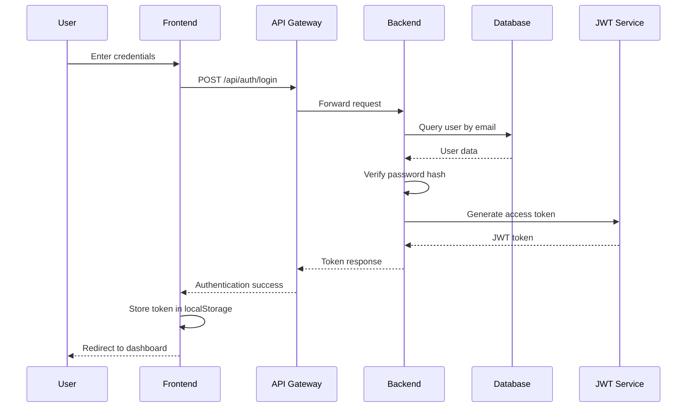
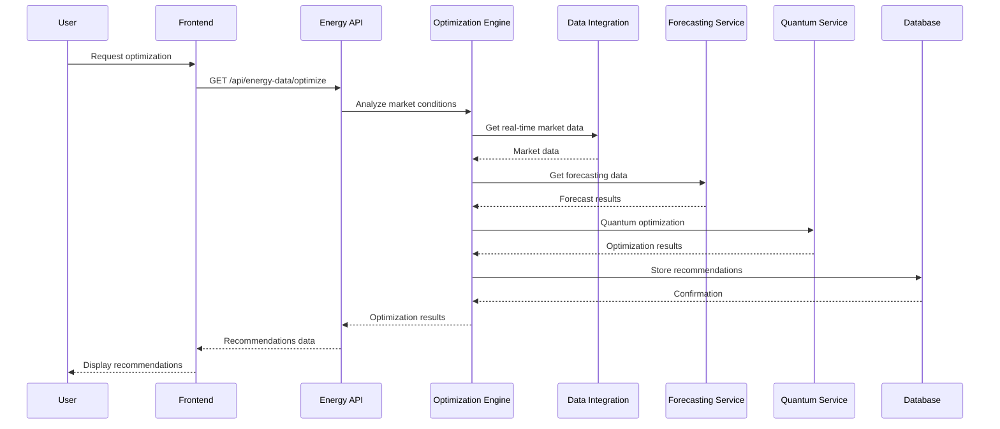
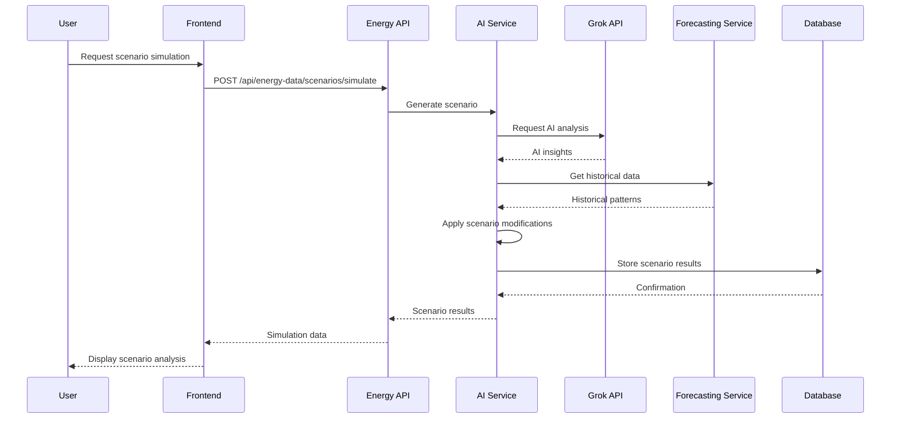
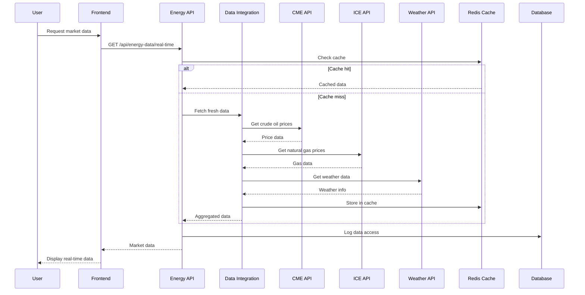
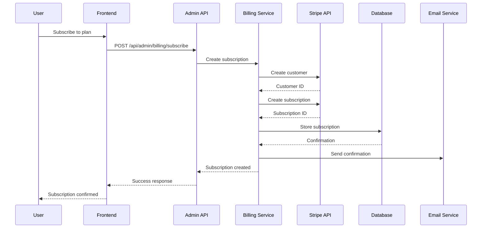
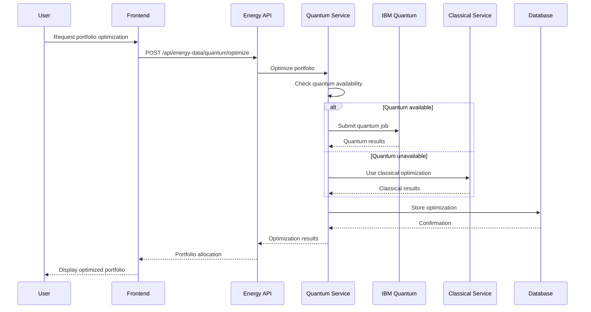
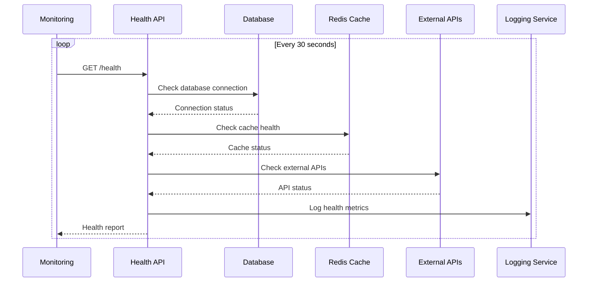
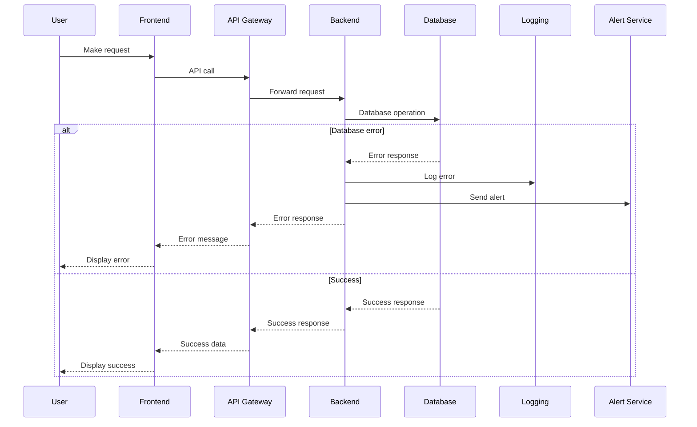

# 🔄 Sequence Diagrams

## User Authentication Flow

## Energy Data Optimization Flow

## AI-Powered Scenario Simulation

## Real-Time Market Data Flow

## Billing and Subscription Flow

## Quantum Portfolio Optimization

## System Health Monitoring

## Error Handling and Recovery

