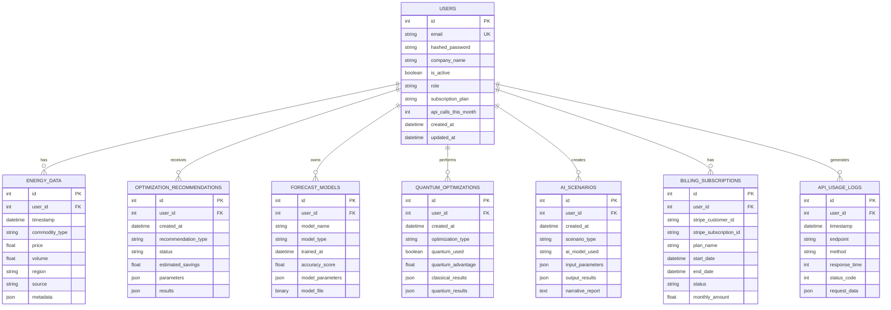

# 🏗️ Structural Diagrams

## Class Structure Diagram

```mermaid
classDiagram
    class FastAPI {
        +app: FastAPI
        +startup_event()
        +shutdown_event()
    }

    class User {
        +id: int
        +email: str
        +hashed_password: str
        +company_name: str
        +is_active: bool
        +role: str
        +subscription_plan: str
        +api_calls_this_month: int
        +created_at: datetime
        +updated_at: datetime
        +energy_data: List[EnergyData]
    }

    class EnergyData {
        +id: int
        +user_id: int
        +timestamp: datetime
        +commodity_type: str
        +price: float
        +volume: float
        +region: str
        +source: str
        +user: User
    }

    class OptimizationEngine {
        +recommendation_history: List
        +optimization_rules: Dict
        +analyze_market_conditions()
        +generate_recommendations()
        +execute_recommendation()
        +get_recommendation_history()
    }

    class ForecastingService {
        +models: Dict
        +historical_data: DataFrame
        +train_model()
        +forecast_future_consumption()
        +get_forecast_insights()
        +retrain_model()
    }

    class QuantumOptimizationService {
        +ibmq_token: str
        +quantum_available: bool
        +optimization_history: List
        +optimize_portfolio()
        +_quantum_portfolio_optimization()
        +_classical_portfolio_optimization()
        +optimize_energy_scheduling()
    }

    class GenerativeAIService {
        +grok_client: GrokClient
        +scenario_history: List
        +simulate_scenario()
        +_generate_scenario_narrative()
        +_apply_scenario_modifications()
        +_generate_scenario_insights()
    }

    class BillingService {
        +stripe_client: Stripe
        +subscription_plans: Dict
        +create_customer()
        +create_subscription()
        +cancel_subscription()
        +update_subscription()
        +get_invoice_history()
        +calculate_bill()
    }

    class DataIntegrationService {
        +cme_api_key: str
        +ice_api_key: str
        +weather_api_key: str
        +get_real_time_market_data()
        +fetch_cme_prices()
        +fetch_ice_prices()
        +fetch_weather_data()
        +get_energy_demand_data()
    }

    class AuthService {
        +secret_key: str
        +algorithm: str
        +access_token_expire_minutes: int
        +create_access_token()
        +verify_token()
        +get_password_hash()
        +verify_password()
    }

    class DatabaseSession {
        +engine: Engine
        +SessionLocal: sessionmaker
        +get_db()
        +create_tables()
        +get_user_scoped_query()
    }

    %% Relationships
    FastAPI --> User
    FastAPI --> EnergyData
    User ||--o{ EnergyData : has
    OptimizationEngine --> EnergyData : analyzes
    ForecastingService --> EnergyData : forecasts
    QuantumOptimizationService --> EnergyData : optimizes
    GenerativeAIService --> EnergyData : simulates
    BillingService --> User : bills
    DataIntegrationService --> EnergyData : provides
    AuthService --> User : authenticates
    DatabaseSession --> User : manages
    DatabaseSession --> EnergyData : manages
```

## Database Schema Diagram



## Component Structure Diagram


## Package Structure Diagram


## Module Dependency Diagram


