# EnergyOpti-Pro System Architecture

## Overview

EnergyOpti-Pro is built on a modern, scalable microservices architecture that leverages cutting-edge technologies for AI/ML, quantum computing, and blockchain integration. The system is designed for high availability, security, and compliance across multiple regions.

## High-Level Architecture

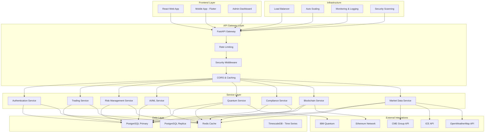

## Service Architecture

### Core Services

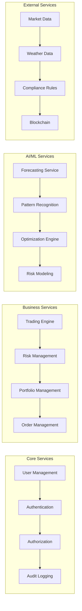

## Data Flow Architecture

### Market Data Flow

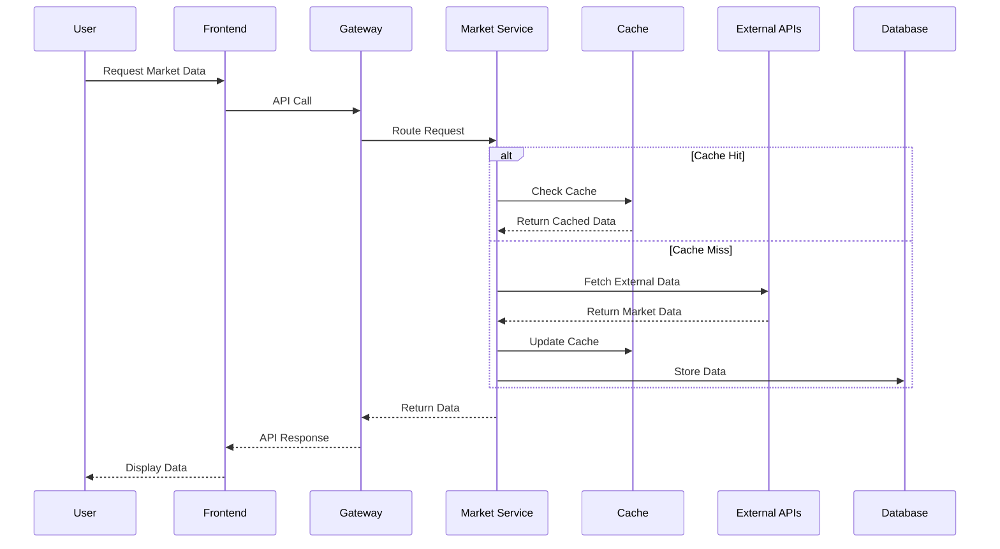

### AI/ML Pipeline

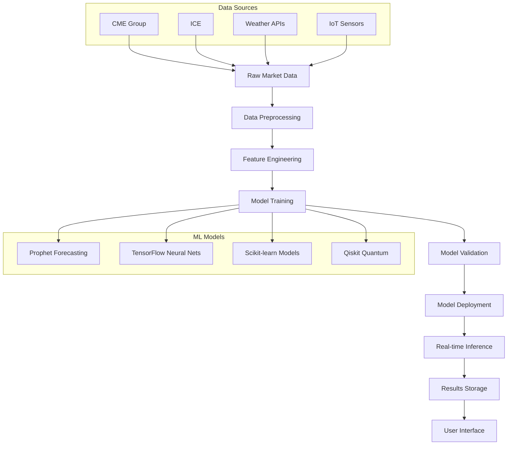

## Security Architecture

### Authentication & Authorization

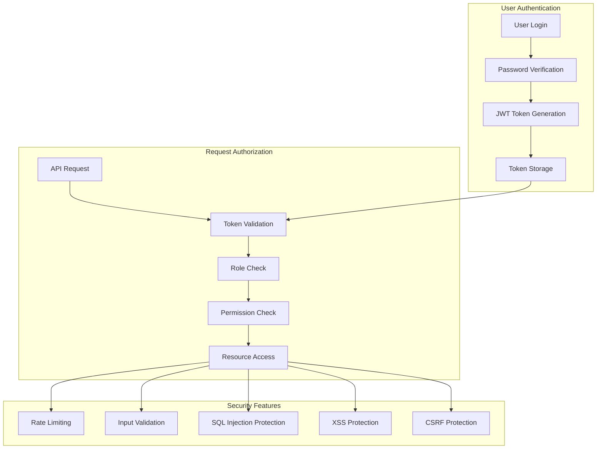

### Post-Quantum Security

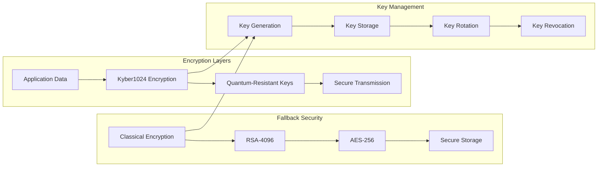

## Compliance Architecture

### Multi-Region Compliance

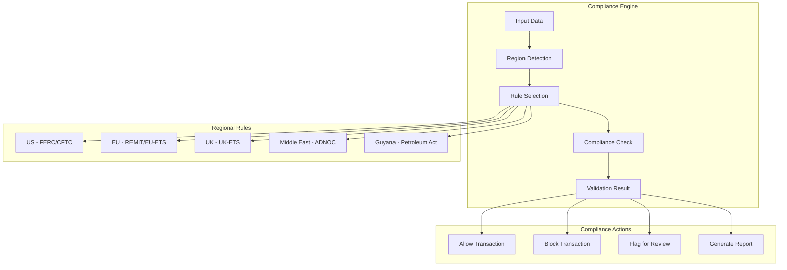

## Deployment Architecture

### Cloud Deployment

```mermaid
graph TB
    subgraph "Frontend - Vercel"
        A[React Build]
        B[Static Assets]
        C[CDN Distribution]
    end
    
    subgraph "Backend - Render"
        D[FastAPI App]
        E[Auto Scaling]
        F[Health Checks]
    end
    
    subgraph "Database - Managed"
        G[PostgreSQL Cluster]
        H[Read Replicas]
        I[Backup & Recovery]
    end
    
    subgraph "Cache - Redis Cloud"
        J[Redis Instance]
        K[Persistence]
        L[High Availability]
    end
    
    A --> B
    B --> C
    
    D --> E
    E --> F
    
    G --> H
    H --> I
    
    J --> K
    K --> L
```

### Container Architecture

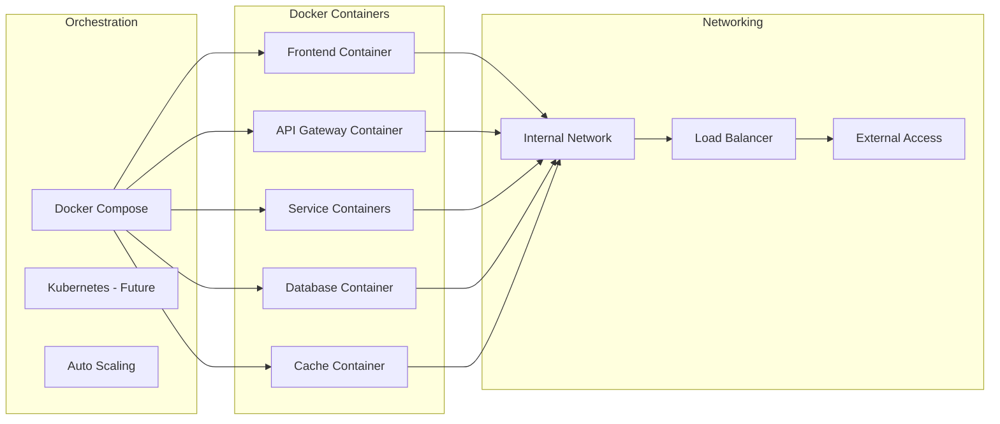

## Monitoring & Observability

### Monitoring Stack

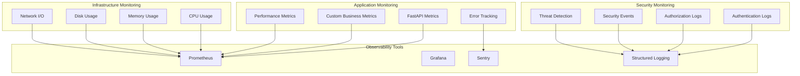

## Performance & Scalability

### Scaling Strategy

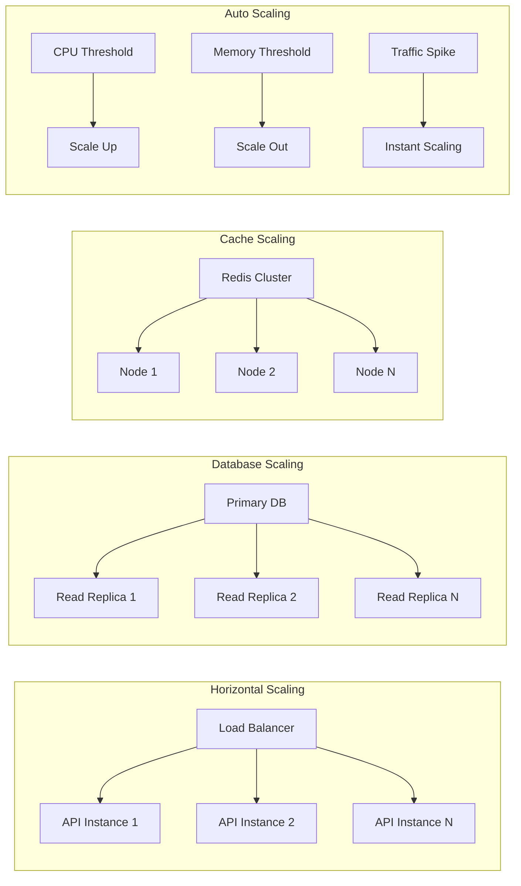

## Disaster Recovery

### Backup & Recovery

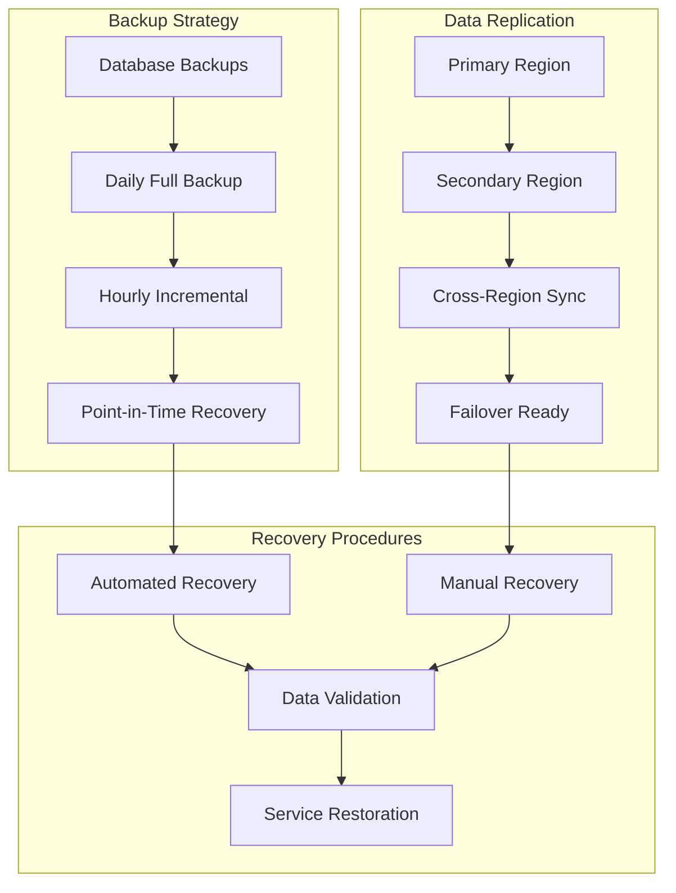

## Technology Stack

### Backend Technologies
- **Framework**: FastAPI (Python 3.9+)
- **Database**: PostgreSQL 13+ with TimescaleDB
- **Cache**: Redis 6+
- **Message Queue**: Celery with Redis
- **Authentication**: JWT with enhanced security
- **API Documentation**: OpenAPI/Swagger

### AI/ML Technologies
- **Forecasting**: Prophet, TensorFlow
- **Machine Learning**: Scikit-learn, PyTorch
- **Quantum Computing**: Qiskit, IBM Quantum
- **Reinforcement Learning**: Stable-Baselines3
- **Data Processing**: Pandas, NumPy

### Frontend Technologies
- **Framework**: React 18+ with TypeScript
- **Styling**: Tailwind CSS
- **State Management**: Redux Toolkit
- **Testing**: Jest, Cypress
- **Build Tool**: Vite

### Infrastructure
- **Containerization**: Docker
- **Orchestration**: Docker Compose (Kubernetes ready)
- **Cloud Platforms**: Vercel, Render, AWS/GCP/Azure
- **Monitoring**: Prometheus, Grafana, Sentry
- **CI/CD**: GitHub Actions

## Security Considerations

### OWASP Top 10 Compliance
1. **Broken Access Control**: Role-based access control with JWT
2. **Cryptographic Failures**: Post-quantum encryption with fallbacks
3. **Injection**: Parameterized queries, input validation
4. **Insecure Design**: Security-first architecture
5. **Security Misconfiguration**: Automated security scanning
6. **Vulnerable Components**: Regular dependency updates
7. **Authentication Failures**: Multi-factor authentication ready
8. **Software Integrity**: Code signing and verification
9. **Security Logging**: Comprehensive audit trails
10. **Server-Side Request Forgery**: Input validation and sanitization

### Compliance Features
- **GDPR**: Data privacy and user rights
- **SOC2**: Security controls and monitoring
- **FERC**: Energy trading compliance
- **CFTC**: Commodity trading compliance
- **REMIT**: EU energy market integrity
- **Islamic Finance**: Shariah-compliant trading

## Future Enhancements

### Planned Features
- **Edge Computing**: IoT device integration
- **5G Integration**: Low-latency trading
- **Advanced AI**: GPT integration for trading insights
- **Quantum Advantage**: Real quantum hardware integration
- **DeFi Integration**: Decentralized finance features
- **Mobile Apps**: Native iOS/Android applications

### Scalability Improvements
- **Microservices**: Service decomposition
- **Event Sourcing**: CQRS pattern implementation
- **GraphQL**: Flexible data querying
- **Real-time Streaming**: WebSocket and Server-Sent Events
- **Global Distribution**: Multi-region deployment

---

*This architecture document is living and will be updated as the system evolves.*
