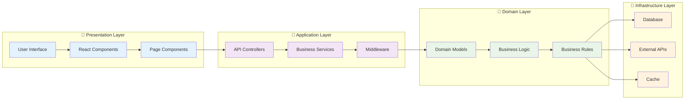

# 🏗️ System Architecture Diagram

## High-Level System Architecture

```mermaid
graph TB
    subgraph "🌐 Client Layer"
        Web[Web Browser]
        Mobile[Mobile App]
        API_Client[API Clients]
    end

    subgraph "🚀 Frontend Layer"
        React[React Frontend]
        Vite[Vite Build System]
        Tailwind[Tailwind CSS]
    end

    subgraph "🔌 API Gateway Layer"
        CORS[CORS Middleware]
        Auth[Authentication]
        RateLimit[Rate Limiting]
    end

    subgraph "⚙️ Backend Services Layer"
        FastAPI[FastAPI Application]
        Auth_Service[Authentication Service]
        Energy_Service[Energy Data Service]
        Admin_Service[Admin Service]
    end

    subgraph "🧠 Business Logic Layer"
        Optimization[Optimization Engine]
        Forecasting[Forecasting Service]
        Quantum[Quantum Optimization]
        AI_Service[Generative AI Service]
        Billing[Billing Service]
        Data_Integration[Data Integration Service]
    end

    subgraph "🗄️ Data Layer"
        SQLite[(SQLite Database)]
        Redis[(Redis Cache)]
        File_Storage[File Storage]
    end

    subgraph "🌍 External Services"
        CME[CME Group API]
        ICE[ICE API]
        Weather[OpenWeatherMap API]
        Stripe[Stripe API]
        IBMQ[IBM Quantum]
        Grok[Grok AI API]
    end

    subgraph "🔒 Security Layer"
        JWT[JWT Tokens]
        Bcrypt[Password Hashing]
        RBAC[Role-Based Access]
        CORS_Sec[CORS Security]
    end

    subgraph "📊 Monitoring & Logging"
        StructLog[Structured Logging]
        Health[Health Checks]
        Metrics[Performance Metrics]
    end

    %% Client to Frontend
    Web --> React
    Mobile --> React
    API_Client --> React

    %% Frontend to API Gateway
    React --> CORS
    React --> Auth
    React --> RateLimit

    %% API Gateway to Backend
    CORS --> FastAPI
    Auth --> FastAPI
    RateLimit --> FastAPI

    %% Backend Services
    FastAPI --> Auth_Service
    FastAPI --> Energy_Service
    FastAPI --> Admin_Service

    %% Business Logic
    Auth_Service --> Optimization
    Energy_Service --> Forecasting
    Energy_Service --> Quantum
    Energy_Service --> AI_Service
    Admin_Service --> Billing
    Energy_Service --> Data_Integration

    %% Data Layer
    Optimization --> SQLite
    Forecasting --> SQLite
    Quantum --> SQLite
    AI_Service --> SQLite
    Billing --> SQLite
    Data_Integration --> Redis

    %% External Services
    Data_Integration --> CME
    Data_Integration --> ICE
    Data_Integration --> Weather
    Billing --> Stripe
    Quantum --> IBMQ
    AI_Service --> Grok

    %% Security
    Auth_Service --> JWT
    Auth_Service --> Bcrypt
    FastAPI --> RBAC
    CORS --> CORS_Sec

    %% Monitoring
    FastAPI --> StructLog
    FastAPI --> Health
    FastAPI --> Metrics

    classDef frontend fill:#e1f5fe
    classDef backend fill:#f3e5f5
    classDef business fill:#e8f5e8
    classDef data fill:#fff3e0
    classDef external fill:#fce4ec
    classDef security fill:#f1f8e9
    classDef monitoring fill:#e0f2f1

    class React,Vite,Tailwind frontend
    class FastAPI,Auth_Service,Energy_Service,Admin_Service backend
    class Optimization,Forecasting,Quantum,AI_Service,Billing,Data_Integration business
    class SQLite,Redis,File_Storage data
    class CME,ICE,Weather,Stripe,IBMQ,Grok external
    class JWT,Bcrypt,RBAC,CORS_Sec security
    class StructLog,Health,Metrics monitoring
```

## Component Architecture

```mermaid
graph LR
    subgraph "🎨 Presentation Layer"
        UI[User Interface]
        Components[React Components]
        Pages[Page Components]
    end

    subgraph "🔌 Application Layer"
        API[API Controllers]
        Services[Business Services]
        Middleware[Middleware]
    end

    subgraph "🏢 Domain Layer"
        Models[Domain Models]
        Logic[Business Logic]
        Rules[Business Rules]
    end

    subgraph "💾 Infrastructure Layer"
        Database[Database]
        External[External APIs]
        Cache[Cache]
    end

    UI --> Components
    Components --> Pages
    Pages --> API
    API --> Services
    Services --> Middleware
    Middleware --> Models
    Models --> Logic
    Logic --> Rules
    Rules --> Database
    Rules --> External
    Rules --> Cache

    classDef presentation fill:#e3f2fd
    classDef application fill:#f3e5f5
    classDef domain fill:#e8f5e8
    classDef infrastructure fill:#fff3e0

    class UI,Components,Pages presentation
    class API,Services,Middleware application
    class Models,Logic,Rules domain
    class Database,External,Cache infrastructure
```

## Technology Stack Architecture

```mermaid
graph TB
    subgraph "Frontend Stack"
        React[React 18]
        TypeScript[TypeScript]
        Vite[Vite]
        Tailwind[Tailwind CSS]
        ChartJS[Chart.js]
        Router[React Router]
    end

    subgraph "Backend Stack"
        FastAPI[FastAPI]
        Python[Python 3.11+]
        SQLAlchemy[SQLAlchemy]
        Pydantic[Pydantic]
        Uvicorn[Uvicorn]
    end

    subgraph "Database Stack"
        SQLite[SQLite]
        Redis[Redis]
        Alembic[Alembic]
    end

    subgraph "AI/ML Stack"
        Prophet[Prophet]
        Scikit[Scikit-learn]
        TensorFlow[TensorFlow]
        Qiskit[Qiskit]
    end

    subgraph "Security Stack"
        JWT[JWT]
        Bcrypt[Bcrypt]
        CORS[CORS]
        RBAC[RBAC]
    end

    subgraph "Deployment Stack"
        Docker[Docker]
        Render[Render]
        Vercel[Vercel]
        GitHub[GitHub]
    end

    React --> TypeScript
    TypeScript --> Vite
    Vite --> Tailwind
    Tailwind --> ChartJS
    ChartJS --> Router

    FastAPI --> Python
    Python --> SQLAlchemy
    SQLAlchemy --> Pydantic
    Pydantic --> Uvicorn

    SQLite --> Redis
    Redis --> Alembic

    Prophet --> Scikit
    Scikit --> TensorFlow
    TensorFlow --> Qiskit

    JWT --> Bcrypt
    Bcrypt --> CORS
    CORS --> RBAC

    Docker --> Render
    Render --> Vercel
    Vercel --> GitHub

    classDef frontend fill:#e1f5fe
    classDef backend fill:#f3e5f5
    classDef database fill:#e8f5e8
    classDef ai fill:#fff3e0
    classDef security fill:#fce4ec
    classDef deployment fill:#f1f8e9

    class React,TypeScript,Vite,Tailwind,ChartJS,Router frontend
    class FastAPI,Python,SQLAlchemy,Pydantic,Uvicorn backend
    class SQLite,Redis,Alembic database
    class Prophet,Scikit,TensorFlow,Qiskit ai
    class JWT,Bcrypt,CORS,RBAC security
    class Docker,Render,Vercel,GitHub deployment
```
