# 💼 QuantaEnergi Business Process & Financial Industry Diagrams

## Energy Trading Workflow

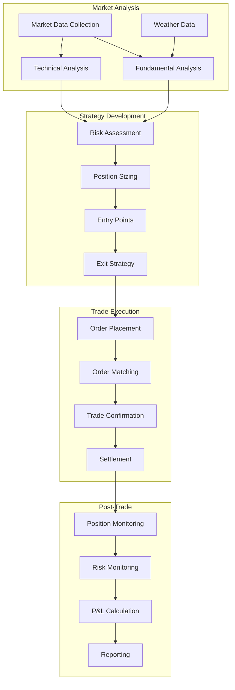

## Islamic Finance Compliance Process

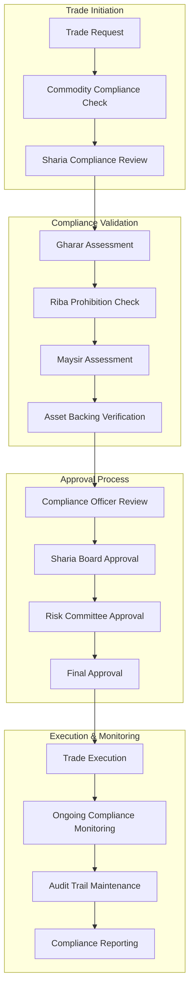

## Risk Management Framework

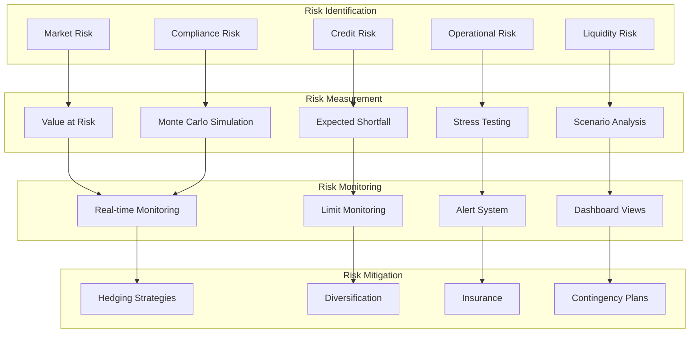

## Customer Onboarding Process

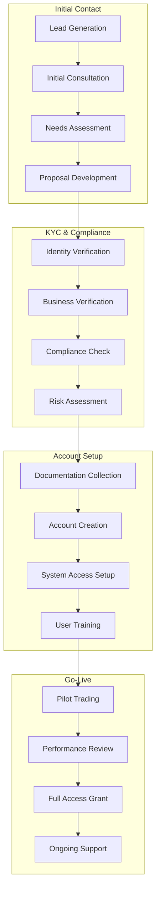

## Portfolio Management Process

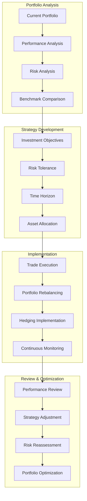

## Regulatory Compliance Framework

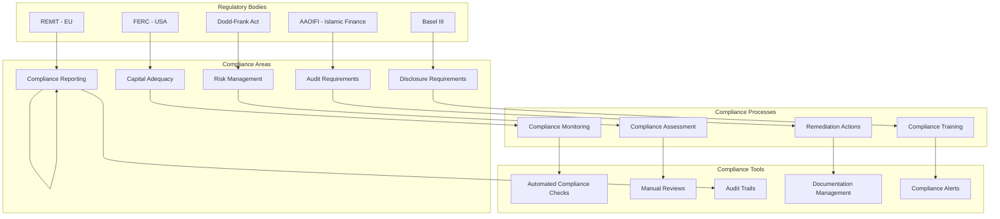

## Market Data Integration

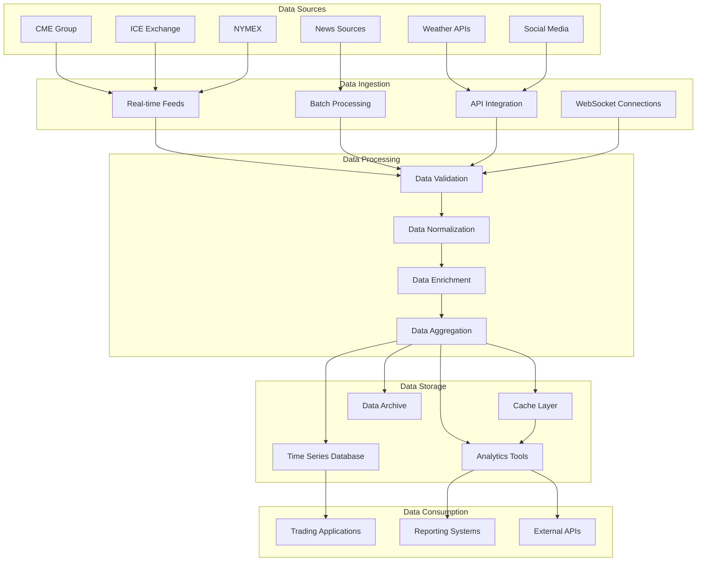

## Business Intelligence & Analytics

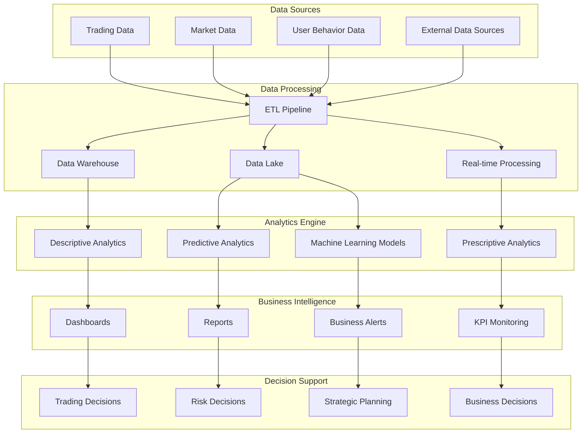

## Supply Chain Management

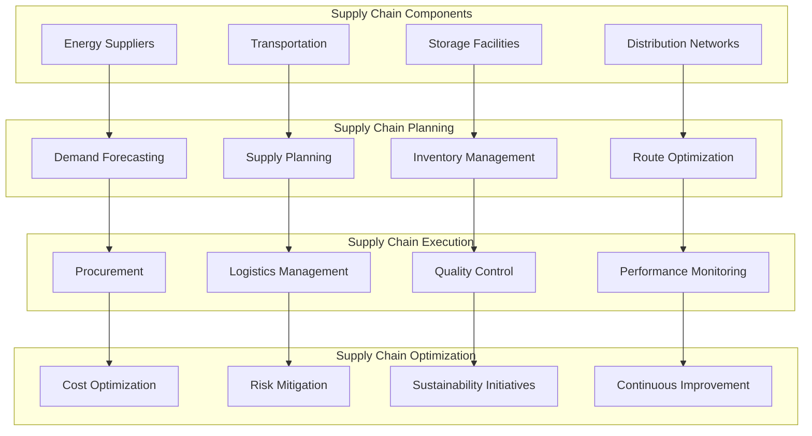

## Revenue & Pricing Model

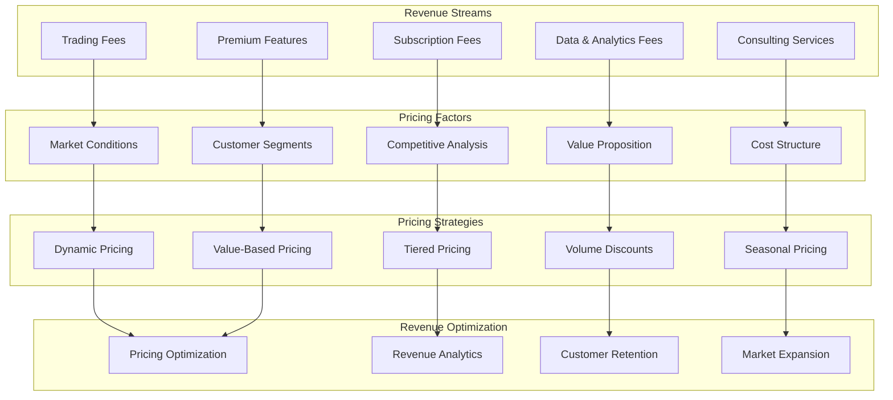

## Customer Success & Support

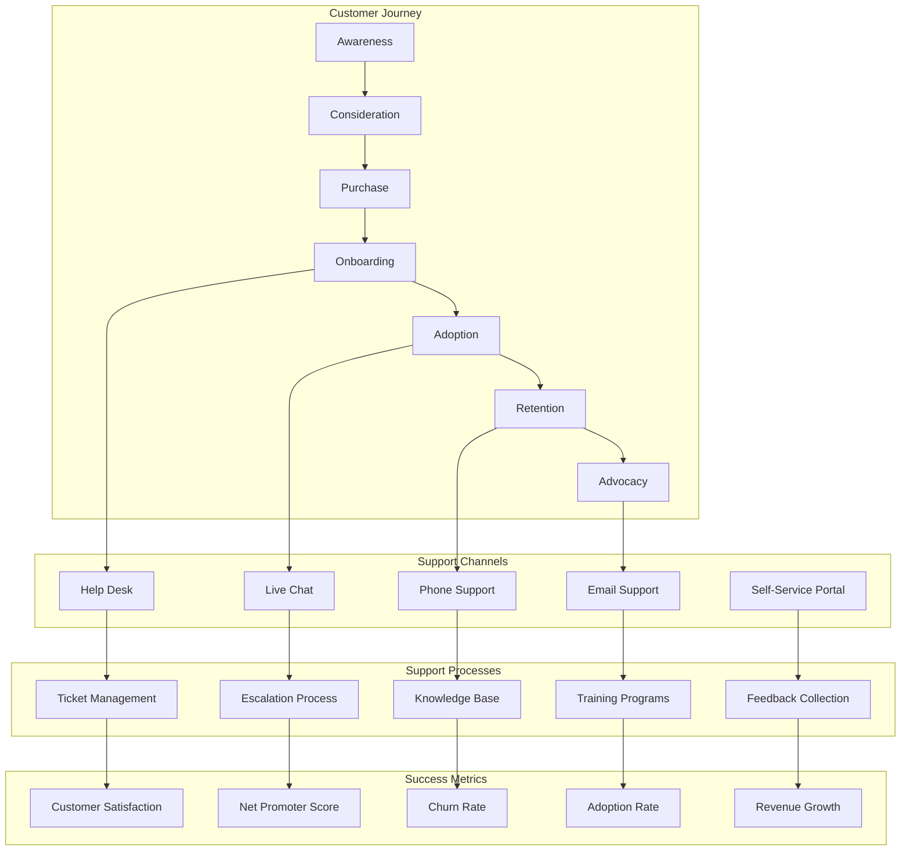

---

## 📊 Business Process Summary

These diagrams cover the complete business landscape:

1. **Energy Trading Workflow** - Complete trading process
2. **Islamic Finance Compliance** - Sharia-compliant trading
3. **Risk Management** - Comprehensive risk framework
4. **Customer Onboarding** - User acquisition process
5. **Portfolio Management** - Investment management
6. **Regulatory Compliance** - Multi-jurisdiction compliance
7. **Market Data Integration** - Data pipeline
8. **Business Intelligence** - Analytics and insights
9. **Supply Chain Management** - Energy logistics
10. **Revenue Model** - Business model and pricing
11. **Customer Success** - Support and retention

All diagrams follow industry best practices for energy trading and financial services.
