# 🚀 QuantaEnergi Deployment Architecture

## Production Deployment Architecture

```mermaid
graph TB
    subgraph "Internet"
        Users[End Users]
        CDN[CloudFront CDN]
    end
    
    subgraph "AWS VPC - Production"
        subgraph "Public Subnet"
            ALB[Application Load Balancer]
            NAT[NAT Gateway]
        end
        
        subgraph "Private Subnet - App Tier"
            subgraph "Kubernetes Cluster"
                subgraph "Control Plane"
                    API[API Server]
                    Scheduler[Scheduler]
                    Controller[Controller Manager]
                end
                
                subgraph "Worker Nodes"
                    Pod1[App Pod 1<br/>Trading Service]
                    Pod2[App Pod 2<br/>Risk Service]
                    Pod3[App Pod 3<br/>Portfolio Service]
                    Pod4[App Pod 4<br/>Compliance Service]
                end
            end
        end
        
        subgraph "Private Subnet - Data Tier"
            RDS[(RDS PostgreSQL<br/>Multi-AZ)]
            ElastiCache[(ElastiCache Redis<br/>Cluster Mode)]
            TimescaleDB[(TimescaleDB<br/>Managed Service)]
        end
        
        subgraph "Private Subnet - Queue Tier"
            MSK[Amazon MSK<br/>Kafka Cluster]
            RabbitMQ[RabbitMQ<br/>Managed Service]
        end
    end
    
    subgraph "Monitoring & Observability"
        Prometheus[Prometheus<br/>Metrics Collection]
        Grafana[Grafana<br/>Dashboards]
        ELK[Amazon OpenSearch<br/>Log Analytics]
        XRay[AWS X-Ray<br/>Distributed Tracing]
    end
    
    subgraph "Security & Compliance"
        WAF[AWS WAF<br/>Web Application Firewall]
        Secrets[AWS Secrets Manager<br/>Secrets Management]
        KMS[AWS KMS<br/>Key Management]
        CloudTrail[AWS CloudTrail<br/>Audit Logging]
    end
    
    subgraph "CI/CD Pipeline"
        GitHub[GitHub Repository]
        Actions[GitHub Actions]
        ECR[Amazon ECR<br/>Container Registry]
        CodeDeploy[AWS CodeDeploy]
    end
    
    subgraph "External Services"
        CME[CME Group API]
        ICE[ICE API]
        Banks[Banking APIs]
        Regulators[Regulatory APIs]
    end
    
    %% User Traffic Flow
    Users --> CDN
    CDN --> ALB
    ALB --> WAF
    WAF --> Pod1
    WAF --> Pod2
    WAF --> Pod3
    WAF --> Pod4
    
    %% Internal Communication
    Pod1 --> RDS
    Pod2 --> RDS
    Pod3 --> RDS
    Pod4 --> RDS
    
    Pod1 --> ElastiCache
    Pod2 --> ElastiCache
    Pod3 --> ElastiCache
    Pod4 --> ElastiCache
    
    Pod2 --> TimescaleDB
    Pod3 --> TimescaleDB
    
    Pod1 --> MSK
    Pod2 --> MSK
    Pod3 --> RabbitMQ
    Pod4 --> RabbitMQ
    
    %% Monitoring
    Pod1 --> Prometheus
    Pod2 --> Prometheus
    Pod3 --> Prometheus
    Pod4 --> Prometheus
    
    Prometheus --> Grafana
    Pod1 --> ELK
    Pod2 --> ELK
    Pod3 --> ELK
    Pod4 --> ELK
    
    Pod1 --> XRay
    Pod2 --> XRay
    Pod3 --> XRay
    Pod4 --> XRay
    
    %% Security
    WAF --> Secrets
    Pod1 --> Secrets
    Pod2 --> Secrets
    Pod3 --> Secrets
    Pod4 --> Secrets
    
    Secrets --> KMS
    ALB --> CloudTrail
    
    %% CI/CD
    GitHub --> Actions
    Actions --> ECR
    ECR --> CodeDeploy
    CodeDeploy --> Pod1
    CodeDeploy --> Pod2
    CodeDeploy --> Pod3
    CodeDeploy --> Pod4
    
    %% External Integrations
    Pod1 --> CME
    Pod1 --> ICE
    Pod4 --> Banks
    Pod4 --> Regulators
    
    %% Styling
    classDef internet fill:#e3f2fd,stroke:#1976d2,stroke-width:2px
    classDef aws fill:#fff3e0,stroke:#f57c00,stroke-width:2px
    classDef monitoring fill:#e8f5e8,stroke:#388e3c,stroke-width:2px
    classDef security fill:#fce4ec,stroke:#c2185b,stroke-width:2px
    classDef cicd fill:#f3e5f5,stroke:#7b1fa2,stroke-width:2px
    classDef external fill:#f1f8e9,stroke:#689f38,stroke-width:2px
    
    class Users,CDN internet
    class ALB,NAT,API,Scheduler,Controller,Pod1,Pod2,Pod3,Pod4,RDS,ElastiCache,TimescaleDB,MSK,RabbitMQ aws
    class Prometheus,Grafana,ELK,XRay monitoring
    class WAF,Secrets,KMS,CloudTrail security
    class GitHub,Actions,ECR,CodeDeploy cicd
    class CME,ICE,Banks,Regulators external
```

## Deployment Components

### 🌐 **Internet Layer**
- **End Users**: Web and mobile application users
- **CloudFront CDN**: Global content delivery network

### ☁️ **AWS VPC - Production**
- **Public Subnet**: Load balancer and NAT gateway
- **Private Subnet - App Tier**: Kubernetes cluster with application pods
- **Private Subnet - Data Tier**: Managed database services
- **Private Subnet - Queue Tier**: Message queue services

### 📊 **Monitoring & Observability**
- **Prometheus**: Metrics collection and alerting
- **Grafana**: Visualization dashboards
- **Amazon OpenSearch**: Log analytics and search
- **AWS X-Ray**: Distributed tracing

### 🛡️ **Security & Compliance**
- **AWS WAF**: Web application firewall
- **AWS Secrets Manager**: Secrets and configuration management
- **AWS KMS**: Encryption key management
- **AWS CloudTrail**: Audit logging and compliance

### 🔄 **CI/CD Pipeline**
- **GitHub Repository**: Source code management
- **GitHub Actions**: Continuous integration
- **Amazon ECR**: Container image registry
- **AWS CodeDeploy**: Automated deployment

### 🌍 **External Services**
- **CME Group API**: Market data and trading
- **ICE API**: Energy market data
- **Banking APIs**: Payment processing
- **Regulatory APIs**: Compliance reporting

## Deployment Features

✅ **High Availability**: Multi-AZ deployment with auto-scaling
✅ **Security**: Multi-layer security with WAF and encryption
✅ **Monitoring**: Comprehensive observability stack
✅ **CI/CD**: Automated deployment pipeline
✅ **Scalability**: Kubernetes-based horizontal scaling
✅ **Compliance**: Audit logging and regulatory compliance
✅ **Performance**: CDN and caching for optimal performance
✅ **Resilience**: Fault-tolerant architecture with redundancy

---

*Production deployment architecture for enterprise-grade ETRM/CTRM platform.*
