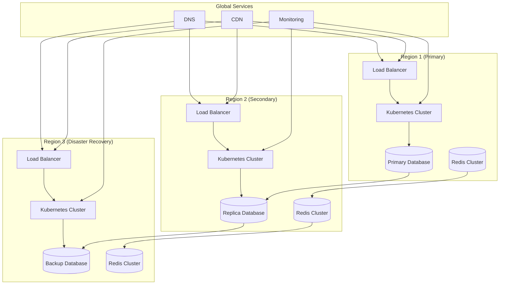

# Multi-Region Kubernetes Deployment Guide

This guide provides comprehensive instructions for deploying the QuantaEnergi ETRM/CTRM system across multiple regions using Kubernetes.

## Overview

The multi-region deployment strategy ensures high availability, disaster recovery, and low latency for global users. The system is designed to run across multiple cloud regions with data replication and failover capabilities.

## Architecture



## Prerequisites

### 1. Cloud Provider Setup

#### AWS
```bash
# Install AWS CLI
curl "https://awscli.amazonaws.com/awscli-exe-linux-x86_64.zip" -o "awscliv2.zip"
unzip awscliv2.zip
sudo ./aws/install

# Configure AWS credentials
aws configure
```

#### Azure
```bash
# Install Azure CLI
curl -sL https://aka.ms/InstallAzureCLIDeb | sudo bash

# Login to Azure
az login
```

#### GCP
```bash
# Install Google Cloud SDK
curl https://sdk.cloud.google.com | bash
exec -l $SHELL

# Initialize and login
gcloud init
```

### 2. Kubernetes Tools

```bash
# Install kubectl
curl -LO "https://dl.k8s.io/release/$(curl -L -s https://dl.k8s.io/release/stable.txt)/bin/linux/amd64/kubectl"
chmod +x kubectl
sudo mv kubectl /usr/local/bin/

# Install Helm
curl https://raw.githubusercontent.com/helm/helm/main/scripts/get-helm-3 | bash

# Install Istio (for service mesh)
curl -L https://istio.io/downloadIstio | sh -
```

## Region Configuration

### 1. Primary Region (US East)

```yaml
# k8s/us-east/config.yaml
apiVersion: v1
kind: ConfigMap
metadata:
  name: region-config
  namespace: quantaenergi
data:
  region: "us-east-1"
  environment: "production"
  primary: "true"
  database_url: "postgresql://db-primary.us-east-1:5432/quantaenergi"
  redis_url: "redis://redis-primary.us-east-1:6379"
  mqtt_broker: "mqtt-primary.us-east-1:1883"
```

### 2. Secondary Region (EU West)

```yaml
# k8s/eu-west/config.yaml
apiVersion: v1
kind: ConfigMap
metadata:
  name: region-config
  namespace: quantaenergi
data:
  region: "eu-west-1"
  environment: "production"
  primary: "false"
  database_url: "postgresql://db-replica.eu-west-1:5432/quantaenergi"
  redis_url: "redis://redis-replica.eu-west-1:6379"
  mqtt_broker: "mqtt-replica.eu-west-1:1883"
```

### 3. Disaster Recovery Region (Asia Pacific)

```yaml
# k8s/ap-southeast/config.yaml
apiVersion: v1
kind: ConfigMap
metadata:
  name: region-config
  namespace: quantaenergi
data:
  region: "ap-southeast-1"
  environment: "production"
  primary: "false"
  database_url: "postgresql://db-backup.ap-southeast-1:5432/quantaenergi"
  redis_url: "redis://redis-backup.ap-southeast-1:6379"
  mqtt_broker: "mqtt-backup.ap-southeast-1:1883"
```

## Database Setup

### 1. Primary Database (PostgreSQL)

```yaml
# k8s/database/primary-postgres.yaml
apiVersion: v1
kind: Secret
metadata:
  name: postgres-secret
  namespace: quantaenergi
type: Opaque
data:
  postgres-password: <base64-encoded-password>
  postgres-user: <base64-encoded-username>

---
apiVersion: apps/v1
kind: StatefulSet
metadata:
  name: postgres-primary
  namespace: quantaenergi
spec:
  serviceName: postgres-primary
  replicas: 1
  selector:
    matchLabels:
      app: postgres-primary
  template:
    metadata:
      labels:
        app: postgres-primary
    spec:
      containers:
      - name: postgres
        image: postgres:14
        env:
        - name: POSTGRES_DB
          value: quantaenergi
        - name: POSTGRES_USER
          valueFrom:
            secretKeyRef:
              name: postgres-secret
              key: postgres-user
        - name: POSTGRES_PASSWORD
          valueFrom:
            secretKeyRef:
              name: postgres-secret
              key: postgres-password
        - name: PGDATA
          value: /var/lib/postgresql/data/pgdata
        ports:
        - containerPort: 5432
        volumeMounts:
        - name: postgres-storage
          mountPath: /var/lib/postgresql/data
        resources:
          requests:
            memory: "2Gi"
            cpu: "1000m"
          limits:
            memory: "4Gi"
            cpu: "2000m"
  volumeClaimTemplates:
  - metadata:
      name: postgres-storage
    spec:
      accessModes: ["ReadWriteOnce"]
      resources:
        requests:
          storage: 100Gi

---
apiVersion: v1
kind: Service
metadata:
  name: postgres-primary
  namespace: quantaenergi
spec:
  selector:
    app: postgres-primary
  ports:
  - port: 5432
    targetPort: 5432
  type: ClusterIP
```

### 2. Database Replication Setup

```sql
-- Primary database configuration
ALTER SYSTEM SET wal_level = replica;
ALTER SYSTEM SET max_wal_senders = 3;
ALTER SYSTEM SET max_replication_slots = 3;
ALTER SYSTEM SET hot_standby = on;
SELECT pg_reload_conf();

-- Create replication user
CREATE USER replicator REPLICATION LOGIN CONNECTION LIMIT 3 ENCRYPTED PASSWORD 'replication_password';

-- Create replication slot
SELECT pg_create_physical_replication_slot('replica_slot');
```

### 3. Redis Cluster Setup

```yaml
# k8s/redis/redis-cluster.yaml
apiVersion: v1
kind: ConfigMap
metadata:
  name: redis-config
  namespace: quantaenergi
data:
  redis.conf: |
    cluster-enabled yes
    cluster-config-file nodes.conf
    cluster-node-timeout 5000
    appendonly yes
    protected-mode no

---
apiVersion: apps/v1
kind: StatefulSet
metadata:
  name: redis-cluster
  namespace: quantaenergi
spec:
  serviceName: redis-cluster
  replicas: 6
  selector:
    matchLabels:
      app: redis-cluster
  template:
    metadata:
      labels:
        app: redis-cluster
    spec:
      containers:
      - name: redis
        image: redis:7-alpine
        command:
        - redis-server
        - /etc/redis/redis.conf
        ports:
        - containerPort: 6379
        - containerPort: 16379
        volumeMounts:
        - name: redis-config
          mountPath: /etc/redis
        - name: redis-data
          mountPath: /data
        resources:
          requests:
            memory: "512Mi"
            cpu: "250m"
          limits:
            memory: "1Gi"
            cpu: "500m"
  volumeClaimTemplates:
  - metadata:
      name: redis-data
    spec:
      accessModes: ["ReadWriteOnce"]
      resources:
        requests:
          storage: 10Gi
```

## Application Deployment

### 1. Backend Services

```yaml
# k8s/backend/backend-deployment.yaml
apiVersion: apps/v1
kind: Deployment
metadata:
  name: backend-api
  namespace: quantaenergi
spec:
  replicas: 3
  selector:
    matchLabels:
      app: backend-api
  template:
    metadata:
      labels:
        app: backend-api
    spec:
      containers:
      - name: backend-api
        image: quantaenergi/backend:latest
        ports:
        - containerPort: 8000
        env:
        - name: DATABASE_URL
          valueFrom:
            configMapKeyRef:
              name: region-config
              key: database_url
        - name: REDIS_URL
          valueFrom:
            configMapKeyRef:
              name: region-config
              key: redis_url
        - name: MQTT_BROKER
          valueFrom:
            configMapKeyRef:
              name: region-config
              key: mqtt_broker
        - name: REGION
          valueFrom:
            configMapKeyRef:
              name: region-config
              key: region
        resources:
          requests:
            memory: "1Gi"
            cpu: "500m"
          limits:
            memory: "2Gi"
            cpu: "1000m"
        livenessProbe:
          httpGet:
            path: /health
            port: 8000
          initialDelaySeconds: 30
          periodSeconds: 10
        readinessProbe:
          httpGet:
            path: /ready
            port: 8000
          initialDelaySeconds: 5
          periodSeconds: 5

---
apiVersion: v1
kind: Service
metadata:
  name: backend-api
  namespace: quantaenergi
spec:
  selector:
    app: backend-api
  ports:
  - port: 8000
    targetPort: 8000
  type: ClusterIP
```

### 2. Frontend Services

```yaml
# k8s/frontend/frontend-deployment.yaml
apiVersion: apps/v1
kind: Deployment
metadata:
  name: frontend
  namespace: quantaenergi
spec:
  replicas: 3
  selector:
    matchLabels:
      app: frontend
  template:
    metadata:
      labels:
        app: frontend
    spec:
      containers:
      - name: frontend
        image: quantaenergi/frontend:latest
        ports:
        - containerPort: 3000
        env:
        - name: API_BASE_URL
          value: "https://api.quantaenergi.com"
        - name: REGION
          valueFrom:
            configMapKeyRef:
              name: region-config
              key: region
        resources:
          requests:
            memory: "256Mi"
            cpu: "100m"
          limits:
            memory: "512Mi"
            cpu: "250m"

---
apiVersion: v1
kind: Service
metadata:
  name: frontend
  namespace: quantaenergi
spec:
  selector:
    app: frontend
  ports:
  - port: 3000
    targetPort: 3000
  type: ClusterIP
```

## Load Balancing and Traffic Management

### 1. Istio Service Mesh Configuration

```yaml
# k8s/istio/virtual-service.yaml
apiVersion: networking.istio.io/v1beta1
kind: VirtualService
metadata:
  name: quantaenergi-vs
  namespace: quantaenergi
spec:
  hosts:
  - api.quantaenergi.com
  http:
  - match:
    - headers:
        region:
          exact: us-east
    route:
    - destination:
        host: backend-api
        subset: us-east
      weight: 100
  - match:
    - headers:
        region:
          exact: eu-west
    route:
    - destination:
        host: backend-api
        subset: eu-west
      weight: 100
  - route:
    - destination:
        host: backend-api
        subset: us-east
      weight: 70
    - destination:
        host: backend-api
        subset: eu-west
      weight: 30

---
apiVersion: networking.istio.io/v1beta1
kind: DestinationRule
metadata:
  name: backend-api-dr
  namespace: quantaenergi
spec:
  host: backend-api
  subsets:
  - name: us-east
    labels:
      region: us-east-1
  - name: eu-west
    labels:
      region: eu-west-1
```

### 2. Global Load Balancer

```yaml
# k8s/ingress/global-ingress.yaml
apiVersion: networking.k8s.io/v1
kind: Ingress
metadata:
  name: global-ingress
  namespace: quantaenergi
  annotations:
    kubernetes.io/ingress.class: nginx
    nginx.ingress.kubernetes.io/ssl-redirect: "true"
    nginx.ingress.kubernetes.io/force-ssl-redirect: "true"
    cert-manager.io/cluster-issuer: "letsencrypt-prod"
spec:
  tls:
  - hosts:
    - api.quantaenergi.com
    secretName: api-tls-secret
  rules:
  - host: api.quantaenergi.com
    http:
      paths:
      - path: /
        pathType: Prefix
        backend:
          service:
            name: backend-api
            port:
              number: 8000
```

## Monitoring and Observability

### 1. Prometheus Configuration

```yaml
# k8s/monitoring/prometheus.yaml
apiVersion: v1
kind: ConfigMap
metadata:
  name: prometheus-config
  namespace: monitoring
data:
  prometheus.yml: |
    global:
      scrape_interval: 15s
      evaluation_interval: 15s
    
    rule_files:
      - "*.rules"
    
    alerting:
      alertmanagers:
        - static_configs:
            - targets:
              - alertmanager:9093
    
    scrape_configs:
      - job_name: 'kubernetes-pods'
        kubernetes_sd_configs:
          - role: pod
        relabel_configs:
          - source_labels: [__meta_kubernetes_pod_annotation_prometheus_io_scrape]
            action: keep
            regex: true
          - source_labels: [__meta_kubernetes_pod_annotation_prometheus_io_path]
            action: replace
            target_label: __metrics_path__
            regex: (.+)
          - source_labels: [__address__, __meta_kubernetes_pod_annotation_prometheus_io_port]
            action: replace
            regex: ([^:]+)(?::\d+)?;(\d+)
            replacement: $1:$2
            target_label: __address__
          - action: labelmap
            regex: __meta_kubernetes_pod_label_(.+)
          - source_labels: [__meta_kubernetes_namespace]
            action: replace
            target_label: kubernetes_namespace
          - source_labels: [__meta_kubernetes_pod_name]
            action: replace
            target_label: kubernetes_pod_name
```

### 2. Grafana Dashboard

```yaml
# k8s/monitoring/grafana-dashboard.yaml
apiVersion: v1
kind: ConfigMap
metadata:
  name: grafana-dashboard
  namespace: monitoring
data:
  dashboard.json: |
    {
      "dashboard": {
        "title": "QuantaEnergi ETRM Dashboard",
        "panels": [
          {
            "title": "API Response Time",
            "type": "graph",
            "targets": [
              {
                "expr": "histogram_quantile(0.95, rate(http_request_duration_seconds_bucket[5m]))",
                "legendFormat": "95th percentile"
              }
            ]
          },
          {
            "title": "Trade Volume",
            "type": "stat",
            "targets": [
              {
                "expr": "sum(rate(trades_created_total[5m]))",
                "legendFormat": "Trades/min"
              }
            ]
          }
        ]
      }
    }
```

## Backup and Disaster Recovery

### 1. Database Backup

```yaml
# k8s/backup/db-backup-cronjob.yaml
apiVersion: batch/v1
kind: CronJob
metadata:
  name: db-backup
  namespace: quantaenergi
spec:
  schedule: "0 2 * * *"  # Daily at 2 AM
  jobTemplate:
    spec:
      template:
        spec:
          containers:
          - name: db-backup
            image: postgres:14
            command:
            - /bin/bash
            - -c
            - |
              pg_dump -h postgres-primary -U postgres quantaenergi | gzip > /backup/quantaenergi-$(date +%Y%m%d).sql.gz
              aws s3 cp /backup/quantaenergi-$(date +%Y%m%d).sql.gz s3://quantaenergi-backups/database/
            env:
            - name: PGPASSWORD
              valueFrom:
                secretKeyRef:
                  name: postgres-secret
                  key: postgres-password
            volumeMounts:
            - name: backup-storage
              mountPath: /backup
          volumes:
          - name: backup-storage
            emptyDir: {}
          restartPolicy: OnFailure
```

### 2. Cross-Region Replication

```yaml
# k8s/replication/cross-region-sync.yaml
apiVersion: apps/v1
kind: Deployment
metadata:
  name: cross-region-sync
  namespace: quantaenergi
spec:
  replicas: 1
  selector:
    matchLabels:
      app: cross-region-sync
  template:
    metadata:
      labels:
        app: cross-region-sync
    spec:
      containers:
      - name: sync
        image: quantaenergi/sync:latest
        env:
        - name: PRIMARY_DB_URL
          value: "postgresql://db-primary.us-east-1:5432/quantaenergi"
        - name: REPLICA_DB_URL
          value: "postgresql://db-replica.eu-west-1:5432/quantaenergi"
        - name: BACKUP_DB_URL
          value: "postgresql://db-backup.ap-southeast-1:5432/quantaenergi"
        resources:
          requests:
            memory: "512Mi"
            cpu: "250m"
          limits:
            memory: "1Gi"
            cpu: "500m"
```

## Deployment Scripts

### 1. Multi-Region Deployment Script

```bash
#!/bin/bash
# deploy-multi-region.sh

set -e

REGIONS=("us-east-1" "eu-west-1" "ap-southeast-1")
NAMESPACE="quantaenergi"

echo "Starting multi-region deployment..."

for region in "${REGIONS[@]}"; do
    echo "Deploying to region: $region"
    
    # Set kubectl context
    kubectl config use-context $region
    
    # Create namespace
    kubectl create namespace $NAMESPACE --dry-run=client -o yaml | kubectl apply -f -
    
    # Deploy database
    kubectl apply -f k8s/database/primary-postgres.yaml
    
    # Deploy Redis
    kubectl apply -f k8s/redis/redis-cluster.yaml
    
    # Deploy backend
    kubectl apply -f k8s/backend/backend-deployment.yaml
    
    # Deploy frontend
    kubectl apply -f k8s/frontend/frontend-deployment.yaml
    
    # Deploy monitoring
    kubectl apply -f k8s/monitoring/
    
    echo "Deployment completed for region: $region"
done

echo "Multi-region deployment completed successfully!"
```

### 2. Health Check Script

```bash
#!/bin/bash
# health-check.sh

set -e

REGIONS=("us-east-1" "eu-west-1" "ap-southeast-1")
NAMESPACE="quantaenergi"

echo "Starting health check..."

for region in "${REGIONS[@]}"; do
    echo "Checking health for region: $region"
    
    kubectl config use-context $region
    
    # Check pod status
    kubectl get pods -n $NAMESPACE
    
    # Check service status
    kubectl get services -n $NAMESPACE
    
    # Check ingress status
    kubectl get ingress -n $NAMESPACE
    
    # Test API endpoint
    kubectl run test-pod --image=curlimages/curl --rm -i --restart=Never -- curl -f http://backend-api:8000/health
    
    echo "Health check completed for region: $region"
done

echo "All regions are healthy!"
```

## Security Configuration

### 1. Network Policies

```yaml
# k8s/security/network-policies.yaml
apiVersion: networking.k8s.io/v1
kind: NetworkPolicy
metadata:
  name: backend-network-policy
  namespace: quantaenergi
spec:
  podSelector:
    matchLabels:
      app: backend-api
  policyTypes:
  - Ingress
  - Egress
  ingress:
  - from:
    - namespaceSelector:
        matchLabels:
          name: quantaenergi
    - podSelector:
        matchLabels:
          app: frontend
    ports:
    - protocol: TCP
      port: 8000
  egress:
  - to:
    - podSelector:
        matchLabels:
          app: postgres-primary
    ports:
    - protocol: TCP
      port: 5432
  - to:
    - podSelector:
        matchLabels:
          app: redis-cluster
    ports:
    - protocol: TCP
      port: 6379
```

### 2. Pod Security Policies

```yaml
# k8s/security/pod-security-policy.yaml
apiVersion: policy/v1beta1
kind: PodSecurityPolicy
metadata:
  name: quantaenergi-psp
  namespace: quantaenergi
spec:
  privileged: false
  allowPrivilegeEscalation: false
  requiredDropCapabilities:
    - ALL
  volumes:
    - 'configMap'
    - 'emptyDir'
    - 'projected'
    - 'secret'
    - 'downwardAPI'
    - 'persistentVolumeClaim'
  runAsUser:
    rule: 'MustRunAsNonRoot'
  seLinux:
    rule: 'RunAsAny'
  fsGroup:
    rule: 'RunAsAny'
```

## Performance Optimization

### 1. Horizontal Pod Autoscaler

```yaml
# k8s/autoscaling/hpa.yaml
apiVersion: autoscaling/v2
kind: HorizontalPodAutoscaler
metadata:
  name: backend-api-hpa
  namespace: quantaenergi
spec:
  scaleTargetRef:
    apiVersion: apps/v1
    kind: Deployment
    name: backend-api
  minReplicas: 3
  maxReplicas: 10
  metrics:
  - type: Resource
    resource:
      name: cpu
      target:
        type: Utilization
        averageUtilization: 70
  - type: Resource
    resource:
      name: memory
      target:
        type: Utilization
        averageUtilization: 80
```

### 2. Vertical Pod Autoscaler

```yaml
# k8s/autoscaling/vpa.yaml
apiVersion: autoscaling.k8s.io/v1
kind: VerticalPodAutoscaler
metadata:
  name: backend-api-vpa
  namespace: quantaenergi
spec:
  targetRef:
    apiVersion: apps/v1
    kind: Deployment
    name: backend-api
  updatePolicy:
    updateMode: "Auto"
  resourcePolicy:
    containerPolicies:
    - containerName: backend-api
      minAllowed:
        cpu: 100m
        memory: 128Mi
      maxAllowed:
        cpu: 2000m
        memory: 4Gi
```

## Troubleshooting

### Common Issues

1. **Database Connection Issues**
   ```bash
   # Check database connectivity
   kubectl exec -it postgres-primary-0 -n quantaenergi -- psql -U postgres -d quantaenergi -c "SELECT 1;"
   ```

2. **Redis Connection Issues**
   ```bash
   # Check Redis connectivity
   kubectl exec -it redis-cluster-0 -n quantaenergi -- redis-cli ping
   ```

3. **Service Discovery Issues**
   ```bash
   # Check service endpoints
   kubectl get endpoints -n quantaenergi
   ```

4. **Ingress Issues**
   ```bash
   # Check ingress status
   kubectl describe ingress global-ingress -n quantaenergi
   ```

### Log Analysis

```bash
# View application logs
kubectl logs -f deployment/backend-api -n quantaenergi

# View system logs
kubectl logs -f deployment/frontend -n quantaenergi

# View database logs
kubectl logs -f statefulset/postgres-primary -n quantaenergi
```

## Maintenance

### Rolling Updates

```bash
# Update backend deployment
kubectl set image deployment/backend-api backend-api=quantaenergi/backend:v2.0.0 -n quantaenergi

# Monitor rollout
kubectl rollout status deployment/backend-api -n quantaenergi

# Rollback if needed
kubectl rollout undo deployment/backend-api -n quantaenergi
```

### Scaling Operations

```bash
# Scale backend deployment
kubectl scale deployment backend-api --replicas=5 -n quantaenergi

# Scale database (if using operator)
kubectl patch postgrescluster postgres-primary --type='merge' -p='{"spec":{"instances":3}}' -n quantaenergi
```

This comprehensive deployment guide ensures the QuantaEnergi ETRM/CTRM system can be deployed across multiple regions with high availability, disaster recovery, and optimal performance.
