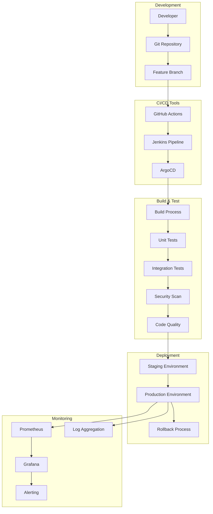
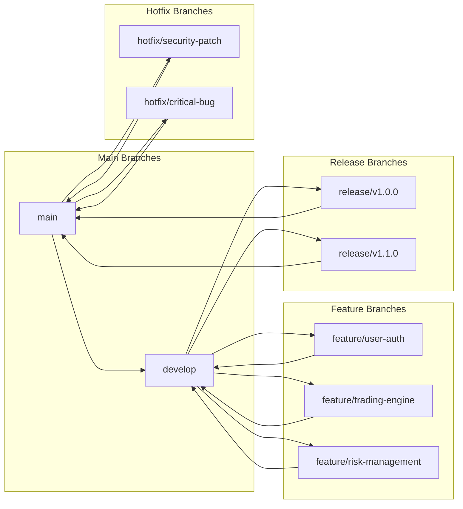
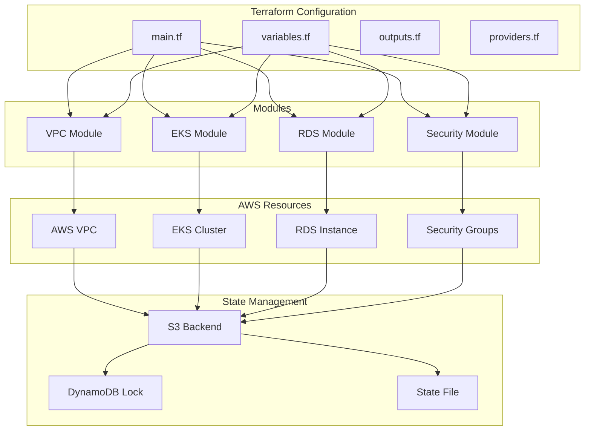
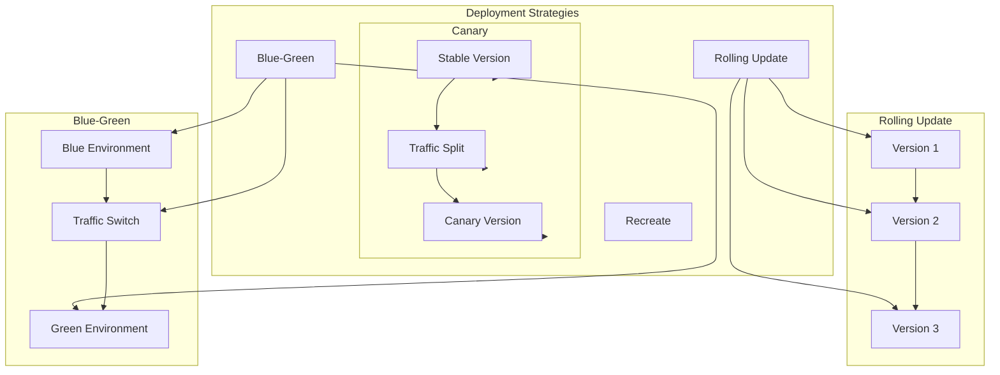
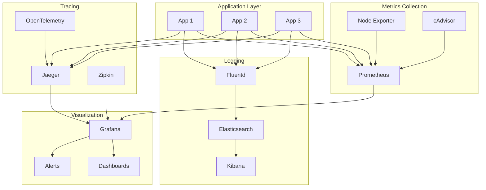
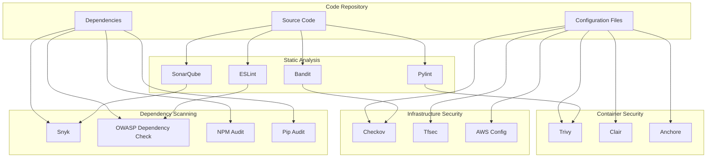
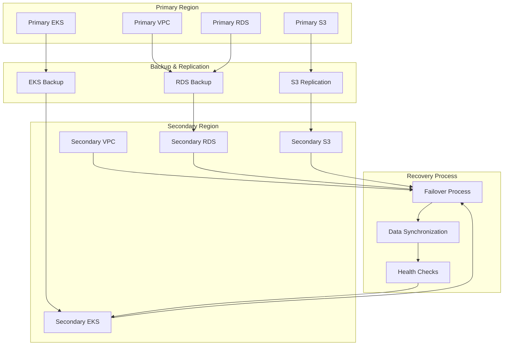
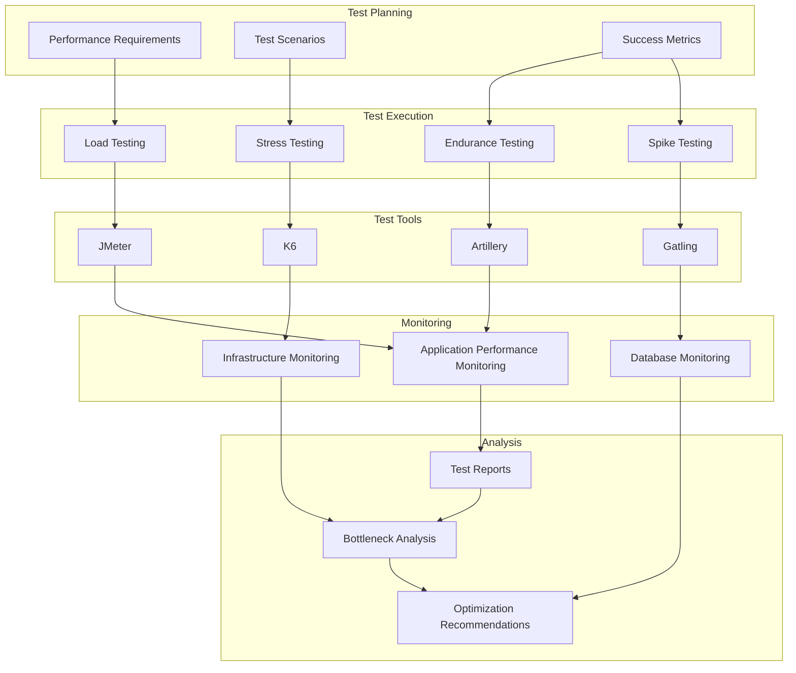
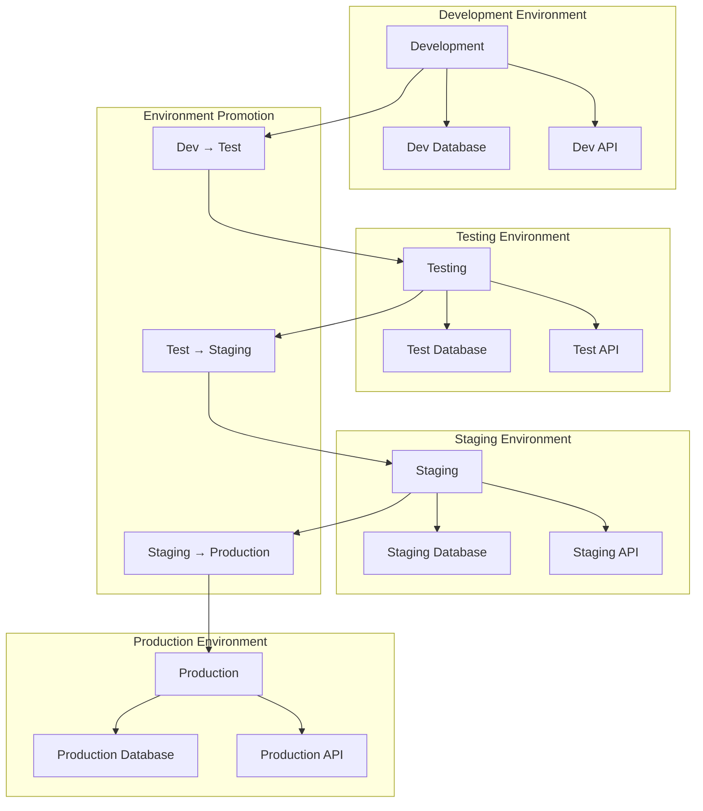

# 🚀 QuantaEnergi DevOps & CI/CD Diagrams

## CI/CD Pipeline Architecture



## Git Workflow (GitFlow)



## Infrastructure as Code (Terraform)



## Kubernetes Deployment Strategy



## Monitoring & Observability Stack



## Security Scanning Pipeline



## Disaster Recovery Architecture



## Performance Testing Pipeline



## Release Management Process

```mermaid
graph TB
    subgraph "Release Planning"
        Roadmap[Product Roadmap]
        Features[Feature Planning]
        Timeline[Release Timeline]
    end
    
    subgraph "Development"
        Sprint[Sprint Planning]
        Development[Development]
        CodeReview[Code Review]
    end
    
    subgraph "Testing"
        UnitTesting[Unit Testing]
        IntegrationTesting[Integration Testing]
        UAT[User Acceptance Testing]
    end
    
    subgraph "Release"
        StagingDeploy[Staging Deployment]
        ProductionDeploy[Production Deployment]
        Rollback[Rollback Plan]
    end
    
    subgraph "Post-Release"
        Monitoring[Post-Release Monitoring]
        Feedback[User Feedback]
        Documentation[Documentation Update]
    end
    
    Roadmap --> Sprint
    Features --> Development
    Timeline --> Sprint
    
    Sprint --> Development
    Development --> CodeReview
    CodeReview --> UnitTesting
    
    UnitTesting --> IntegrationTesting
    IntegrationTesting --> UAT
    UAT --> StagingDeploy
    
    StagingDeploy --> ProductionDeploy
    ProductionDeploy --> Rollback
    ProductionDeploy --> Monitoring
    
    Monitoring --> Feedback
    Feedback --> Documentation
    Documentation --> Roadmap
```

## Environment Management



---

## 📊 DevOps Summary

These diagrams cover the complete DevOps and CI/CD landscape:

1. **CI/CD Pipeline** - Complete automation workflow
2. **Git Workflow** - GitFlow branching strategy
3. **Infrastructure as Code** - Terraform configuration
4. **Kubernetes Deployment** - Multiple deployment strategies
5. **Monitoring Stack** - Comprehensive observability
6. **Security Scanning** - Multi-layer security validation
7. **Disaster Recovery** - Business continuity planning
8. **Performance Testing** - Quality assurance pipeline
9. **Release Management** - Structured release process
10. **Environment Management** - Environment promotion workflow

All diagrams follow industry best practices for enterprise DevOps and CI/CD implementation.
