# 🏗️ QuantaEnergi System Architecture

## Complete System Architecture Diagram

```mermaid
graph TB
    subgraph "Client Layer"
        Web[🌐 Web Dashboard<br/>React + TypeScript]
        Mobile[📱 Mobile App<br/>React Native]
        API_Client[🔌 API Clients<br/>Third-party Integrations]
        Admin[👨‍💼 Admin Panel<br/>Management Interface]
    end
    
    subgraph "Load Balancer & CDN"
        ALB[⚖️ AWS Application<br/>Load Balancer]
        CDN[🌍 CloudFront CDN<br/>Global Distribution]
        WAF[🛡️ AWS WAF<br/>Web Application Firewall]
    end
    
    subgraph "API Gateway Layer"
        Gateway[🚪 Kong/Envoy Gateway<br/>Rate Limiting & Auth]
        RateLimit[⏱️ Enhanced Rate Limiter<br/>Multi-tier Limiting]
        Auth[🔐 JWT Authentication<br/>RBAC & OAuth 2.0]
    end
    
    subgraph "Microservices Layer"
        subgraph "Core Services"
            Trading[📈 Trading Service<br/>FastAPI + Async]
            Risk[⚠️ Risk Management<br/>Real-time Analytics]
            Portfolio[💼 Portfolio Service<br/>Position Management]
            User[👤 User Service<br/>Profile & Preferences]
        end
        
        subgraph "Business Services"
            Compliance[📋 Compliance Service<br/>Regulatory & Sharia]
            Settlement[💰 Settlement Service<br/>Clearing & Payment]
            Reporting[📊 Reporting Service<br/>Analytics & Dashboards]
            Notification[🔔 Notification Service<br/>Real-time Alerts]
        end
        
        subgraph "Advanced Services"
            AI[🤖 AI/ML Service<br/>Market Intelligence]
            Quantum[⚛️ Quantum Service<br/>Portfolio Optimization]
            Blockchain[⛓️ Blockchain Service<br/>Carbon Trading]
            IoT[🌐 IoT Service<br/>Device Integration]
        end
    end
    
    subgraph "Real-time Layer"
        WebSocket[🔌 WebSocket Manager<br/>Observer Pattern]
        EventBus[📡 Event Bus<br/>Async Communication]
        Celery[⚡ Celery Workers<br/>Background Tasks]
        Kafka[📨 Apache Kafka<br/>Message Streaming]
    end
    
    subgraph "Data Layer"
        subgraph "Primary Databases"
            PostgreSQL[(🐘 PostgreSQL<br/>Primary Database)]
            Redis[(🔴 Redis<br/>Cache & Sessions)]
            TimescaleDB[(⏰ TimescaleDB<br/>Time Series Data)]
        end
        
        subgraph "Message Queues"
            RabbitMQ[🐰 RabbitMQ<br/>Task Queues]
            MQTT[📡 MQTT Broker<br/>IoT Communication]
        end
        
        subgraph "External Data"
            MarketAPI[📊 Market Data APIs<br/>CME, ICE, Bloomberg]
            WeatherAPI[🌤️ Weather APIs<br/>Environmental Data]
            NewsAPI[📰 News APIs<br/>Sentiment Analysis]
        end
    end
    
    subgraph "Infrastructure Layer"
        subgraph "Kubernetes Cluster"
            K8s[☸️ EKS Cluster<br/>Container Orchestration]
            Pods[📦 Application Pods<br/>Auto-scaling]
            Services[🔗 K8s Services<br/>Load Balancing]
        end
        
        subgraph "Monitoring & Observability"
            Prometheus[📊 Prometheus<br/>Metrics Collection]
            Grafana[📈 Grafana<br/>Dashboards]
            ELK[🔍 ELK Stack<br/>Logging & Search]
            Jaeger[🔍 Jaeger<br/>Distributed Tracing]
        end
        
        subgraph "Security & Compliance"
            Vault[🔐 HashiCorp Vault<br/>Secrets Management]
            IAM[👤 AWS IAM<br/>Identity Management]
            Audit[📋 Audit Logs<br/>Compliance Tracking]
        end
    end
    
    subgraph "External Integrations"
        CME[🏛️ CME Group<br/>Futures Exchange]
        ICE[🧊 ICE<br/>Energy Exchange]
        Banks[🏦 Banking APIs<br/>Payment Processing]
        Regulators[📜 Regulatory Bodies<br/>Compliance Reporting]
    end
    
    %% Client to Load Balancer
    Web --> CDN
    Mobile --> CDN
    API_Client --> ALB
    Admin --> ALB
    
    %% Load Balancer to Gateway
    CDN --> ALB
    ALB --> WAF
    WAF --> Gateway
    
    %% Gateway to Services
    Gateway --> RateLimit
    RateLimit --> Auth
    Auth --> Trading
    Auth --> Risk
    Auth --> Portfolio
    Auth --> User
    Auth --> Compliance
    Auth --> Settlement
    Auth --> Reporting
    Auth --> Notification
    Auth --> AI
    Auth --> Quantum
    Auth --> Blockchain
    Auth --> IoT
    
    %% Service Interactions
    Trading --> Portfolio
    Trading --> Risk
    Trading --> Settlement
    Risk --> Compliance
    Portfolio --> Reporting
    AI --> Trading
    Quantum --> Portfolio
    Blockchain --> Settlement
    
    %% Real-time Layer
    Trading --> WebSocket
    Risk --> WebSocket
    Portfolio --> WebSocket
    WebSocket --> EventBus
    EventBus --> Celery
    Celery --> Kafka
    
    %% Data Layer Connections
    Trading --> PostgreSQL
    Risk --> PostgreSQL
    Portfolio --> PostgreSQL
    User --> PostgreSQL
    Compliance --> PostgreSQL
    Settlement --> PostgreSQL
    
    Trading --> Redis
    Risk --> Redis
    Portfolio --> Redis
    Auth --> Redis
    
    Risk --> TimescaleDB
    AI --> TimescaleDB
    Reporting --> TimescaleDB
    
    Celery --> RabbitMQ
    IoT --> MQTT
    
    %% External Data
    AI --> MarketAPI
    Risk --> WeatherAPI
    AI --> NewsAPI
    
    %% Infrastructure
    K8s --> Pods
    Pods --> Services
    Services --> Prometheus
    Prometheus --> Grafana
    Services --> ELK
    Services --> Jaeger
    
    %% Security
    Auth --> Vault
    Gateway --> IAM
    Compliance --> Audit
    
    %% External Integrations
    Trading --> CME
    Trading --> ICE
    Settlement --> Banks
    Compliance --> Regulators
    
    %% Styling
    classDef clientLayer fill:#e1f5fe,stroke:#01579b,stroke-width:2px
    classDef gatewayLayer fill:#f3e5f5,stroke:#4a148c,stroke-width:2px
    classDef serviceLayer fill:#e8f5e8,stroke:#1b5e20,stroke-width:2px
    classDef dataLayer fill:#fff3e0,stroke:#e65100,stroke-width:2px
    classDef infraLayer fill:#fce4ec,stroke:#880e4f,stroke-width:2px
    classDef externalLayer fill:#f1f8e9,stroke:#33691e,stroke-width:2px
    
    class Web,Mobile,API_Client,Admin clientLayer
    class ALB,CDN,WAF,Gateway,RateLimit,Auth gatewayLayer
    class Trading,Risk,Portfolio,User,Compliance,Settlement,Reporting,Notification,AI,Quantum,Blockchain,IoT serviceLayer
    class PostgreSQL,Redis,TimescaleDB,RabbitMQ,MQTT,MarketAPI,WeatherAPI,NewsAPI dataLayer
    class K8s,Pods,Services,Prometheus,Grafana,ELK,Jaeger,Vault,IAM,Audit infraLayer
    class CME,ICE,Banks,Regulators externalLayer
```

## Architecture Components

### 🎯 **Client Layer**
- **Web Dashboard**: React + TypeScript frontend
- **Mobile App**: React Native cross-platform
- **API Clients**: Third-party integrations
- **Admin Panel**: Management interface

### 🚪 **API Gateway Layer**
- **Kong/Envoy Gateway**: Request routing and management
- **Enhanced Rate Limiter**: Multi-tier rate limiting with Redis
- **JWT Authentication**: Role-based access control

### 🔧 **Microservices Layer**
- **Core Services**: Trading, Risk, Portfolio, User management
- **Business Services**: Compliance, Settlement, Reporting, Notifications
- **Advanced Services**: AI/ML, Quantum optimization, Blockchain, IoT

### ⚡ **Real-time Layer**
- **WebSocket Manager**: Observer pattern for real-time updates
- **Event Bus**: Async communication between services
- **Celery Workers**: Background task processing
- **Apache Kafka**: Message streaming

### 💾 **Data Layer**
- **PostgreSQL**: Primary transactional database
- **Redis**: Caching and session management
- **TimescaleDB**: Time-series data for analytics
- **Message Queues**: RabbitMQ and MQTT for async processing

### ☸️ **Infrastructure Layer**
- **Kubernetes**: Container orchestration with EKS
- **Monitoring**: Prometheus, Grafana, ELK Stack, Jaeger
- **Security**: HashiCorp Vault, AWS IAM, Audit logging

### 🌐 **External Integrations**
- **Exchanges**: CME Group, ICE for market data
- **Banking**: Payment processing APIs
- **Regulatory**: Compliance reporting systems

## Key Features

✅ **Production Ready**: All systems operational and tested
✅ **Scalable**: Microservices architecture with auto-scaling
✅ **Secure**: Multi-layer security with enterprise-grade authentication
✅ **Real-time**: WebSocket connections with observer pattern
✅ **High Performance**: Async processing with Celery workers
✅ **Compliant**: Regulatory and Sharia compliance built-in
✅ **Observable**: Comprehensive monitoring and logging
✅ **Resilient**: Graceful fallbacks and error handling

---

*This architecture diagram represents the complete QuantaEnergi ETRM/CTRM platform with all implemented features and enterprise-grade capabilities.*
