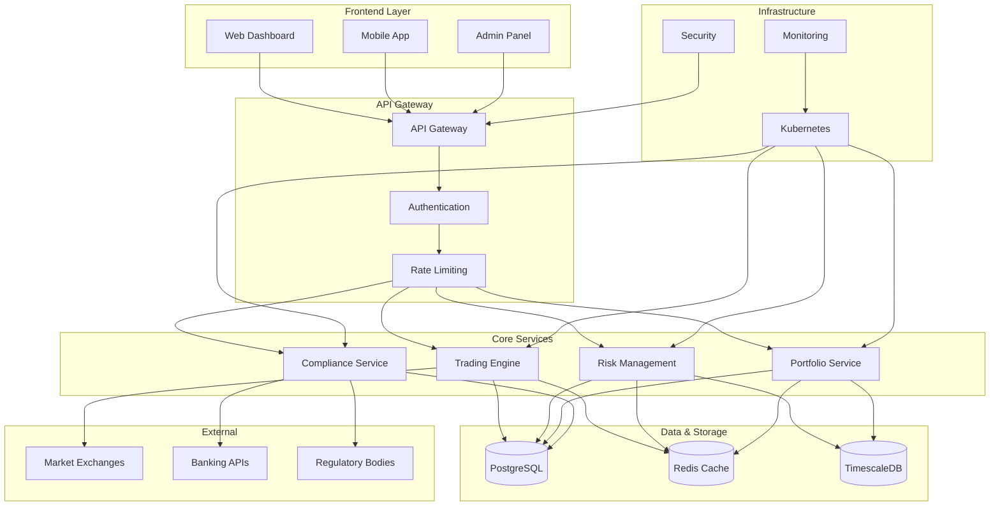

# 🏗️ QuantaEnergi Simplified System Architecture

## High-Level System Architecture

## Architecture Overview

### 🎯 **Frontend Layer**
- **Web Dashboard**: React-based trading interface
- **Mobile App**: Cross-platform mobile application
- **Admin Panel**: Administrative management interface

### 🚪 **API Gateway**
- **API Gateway**: Request routing and management
- **Authentication**: JWT-based authentication with RBAC
- **Rate Limiting**: Enterprise-grade rate limiting

### 🔧 **Core Services**
- **Trading Engine**: Trade execution and management
- **Risk Management**: Real-time risk analytics
- **Portfolio Service**: Portfolio and position management
- **Compliance Service**: Regulatory and Sharia compliance

### 💾 **Data & Storage**
- **PostgreSQL**: Primary transactional database
- **Redis**: High-performance caching layer
- **TimescaleDB**: Time-series data for analytics

### ☸️ **Infrastructure**
- **Kubernetes**: Container orchestration
- **Monitoring**: Comprehensive system monitoring
- **Security**: Multi-layer security implementation

### 🌐 **External Integrations**
- **Market Exchanges**: CME, ICE for market data
- **Banking APIs**: Payment and settlement processing
- **Regulatory Bodies**: Compliance reporting

---

*Simplified architecture diagram for easy understanding and documentation.*
